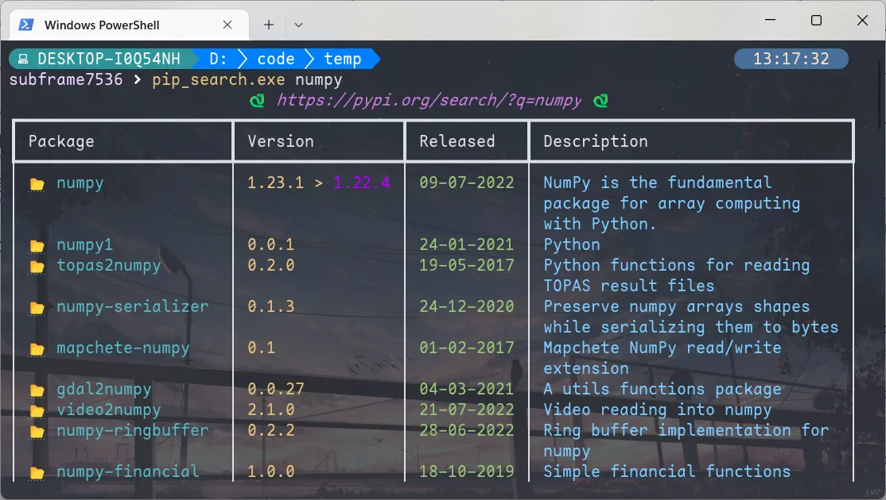

# Maple Series V4

[中文版](/README_CN.md)

## Download

in Release

## Maple Mono

Open source rounded Monospace font

- inspired by [Source Code Pro](https://github.com/adobe-fonts/source-code-pro), [Fira Code Retina](https://github.com/tonsky/FiraCode), ubuntu mono, operator mono, [sarasa mono sc nerd](https://github.com/laishulu/Sarasa-Mono-SC-Nerd) and so on
- modify `@ # $ % &` shape
- only contains latin, table control characters and few symbols
- with **ligatures**
- **cursive** style
- `source/mono.fea`: more readable OpenType Script

### Maple Mono NF

Font for Cli, Maple Mono mixing [Nerd Fonts](https://github.com/ryanoasis/nerd-fonts)

### Sample

#### Total


### Command Line


#### React


#### Vue


#### Java


#### Go


#### Python


#### Rust


#### Cli



## Dev

### usage

python fonttools

### build

```
git clone https://github.com/subframe7536/Maple-font
cd Maple-font/source
pip install fonttools
python build.py
```

## License

SIL Open Font License 1.1
