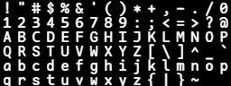

# subcode
self-use monospace font with round corner for coding, mixing HarmonyOS Sans SC

自用的圆角等宽字体，混合了鸿蒙sans，英文为个人修改，参考了Fira Code、Consolas、Menlo、Roboto等优秀字体，部分字符个性化比较强
## sample

## License
Apache 2.0