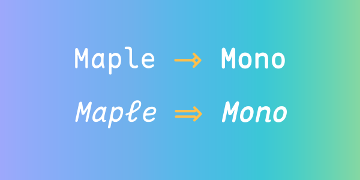
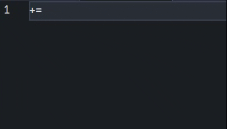
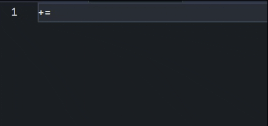
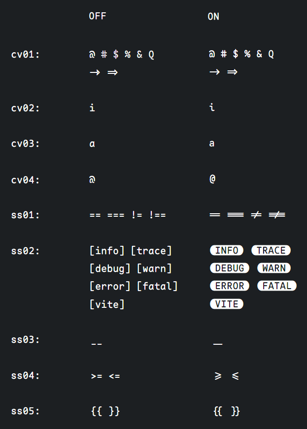

 

  

<h1 align="center"> Maple Font </h1>

Open source monospace & nerd font with round corners and ligatures.

  

  <a href="#install">install</a> |
  <a href="https://github.com/users/subframe7536/projects/1">what's next</a> |
  English |
  <a href="./README_CN.md">中文</a>

## Preparing for [V7](https://github.com/subframe7536/maple-font/tree/variable), try the new variable font at [latest release](https://github.com/subframe7536/maple-font/releases)

## Features

Inspired by [Source Code Pro](https://github.com/adobe-fonts/source-code-pro), [Fira Code Retina](https://github.com/tonsky/FiraCode), [Sarasa Mono SC Nerd](https://github.com/laishulu/Sarasa-Mono-SC-Nerd) and so on, but:

- 🎨 **New shape** - such as `@ # $ % &` and new shape of italic style
- 🤙🏻 **More ligatures** - such as `.., ..., /*, /**`
- 📦 **Small size** - leave only contains Latin, standard set of accents, table control characters and few symbols
- 🦾 **Better rendering effect** - redesigned it according to Fira Code Retina's spacing and glyph

  |                           v4                           |                           v5                            |
  | :----------------------------------------------------: | :-----------------------------------------------------: |
  |  |  |
  |     `+` and `=` are not centered at some font-size     |             `+` and `=` are always centered             |

- 🗒 **More readable** - cursive style, better glyph shape, lower the height of capital letters and numbers, reduce or modify kerning and center operators `+ - * = ^ ~ < >`
- 🛠️ **More configurable** - enable or disable font features as you want, just make your own font
- ✨ See it in [screenshots](#screenshots)

## Install

### V6

| Platform   | Command                                                                          |
| :--------- | :------------------------------------------------------------------------------- |
| macOS      | `brew install --cask font-maple`                                                 |
| Arch Linux | `paru -S ttf-maple`                                                              |
| Others     | Download in [releases](https://github.com/subframe7536/Maple-font/releases/v6.4) |

### V7 Beta

| Platform   | Command                  |
| :--------- | :----------------------- |
| Arch Linux | `paru -S ttf-maple-beta` |

## Notice

Because I don't have a Mac OS machine, this is the greatest adaption I can do with Mac OS currently, but I can't test whether it works.

My ability is not enough to solve other problems on Mac OS. I will record the problem and try to solve it, and **PR welcome!**

`Maple Mono NF` now maybe can't be recognized as Mono, and I try my best but it doesn't work orz

## Overview

 
 
 
multiple ways to get TODO tag 
ps: in JetBrains' product, [todo) can't be properly rendered, so please use todo)) 

 
<h3 align="center">font features are different in V7, see in <a href="https://github.com/subframe7536/maple-font/tree/variable?tab=readme-ov-file#features">docs</h3> 
Compatibility & usage: in <a href="https://github.com/tonsky/FiraCode#editor-compatibility-list" target="_blank">FiraCode README</a>

## Screenshots

Code theme: [vscode-theme-maple](https://github.com/subframe7536/vscode-theme-maple)

~~generate by: [VSCodeSnap](https://github.com/luisllamasbinaburo/VSCodeSnap)~~ Seems deprecated, so I made a new one: [CodeImg](https://github.com/subframe7536/vscode-codeimg)

<b>Cli (click to expand!)</b>

<b>React</b>

<b>Vue</b>

<b>Java</b>

<b>Go</b>

  

<b>Python</b>

<b>Rust</b>

## Build your own font

See [doc](./source/README.md)

## Donate

If this was helpful to you, please feel free to buy me a coffee

## License

SIL Open Font License 1.1
