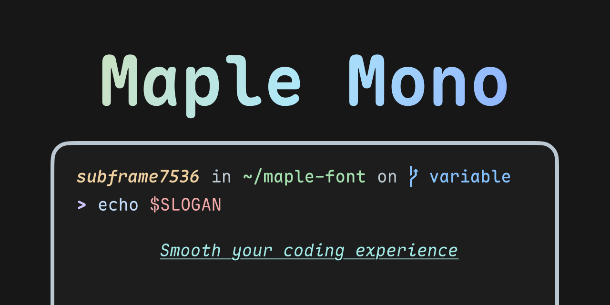

> [!note]
> ### When will V7 become stable?
> It is almost stable now.
>
> As a side project during my weekends, I will release a new beta version to fix the bugs reported or encountered in my daily coding within 1-2 weeks, and do some work on the new website and build tools.
>
> If everything goes well, the stable version will be released later this year.



# Maple Mono

Maple Mono is an open source monospace font focused on smoothing your coding flow.

I create it to enhance my working experience, and hope that it can be useful to others.

V7 is a completely remade version, providing variable font, redesigning more than half of the glyphs and offering smarter ligatures. You can checkout V6 [here](https://github.com/subframe7536/maple-font/tree/main)

## Features

- ✨ Variable - Infinity font weights with fine-grained italic glyphs.
- ☁️ Smooth - Round corner, brand-new glyph of `@ $ % & Q ->` and cursive `f i j k l x y` in italic style.
- 💪 Useful - Large amount of smart ligatures, see in [`features/`](./source/features/README.md)
- 🎨 Icon - First-Class [Nerd-Font](https://github.com/ryanoasis/nerd-fonts) support, make your terminal more vivid.
- 🔨 Customize - Enable or disable font features as you want, just make your own font.

## ScreenShots


- Generated by [CodeImg](https://github.com/subframe7536/vscode-codeimg)
- Theme: [Maple](https://github.com/subframe7536/vscode-theme-maple)

## Download

You can download all the font archives from [Releases](https://github.com/subframe7536/maple-font/releases).

### Arch Linux

```shell
paru -S ttf-maple-beta
```

## Naming FAQ

### Features

- **Ligature**: Default version with ligatures (`Maple Mono`)
- **No-Ligature**: Default version without ligatures (`Maple Mono NL`)
- **Normal-Ligature**: [`--normal` preset](#preset) with ligatures (`Maple Mono Normal`)
- **Normal-No-Ligature**: [`--normal` preset](#preset) without ligatures (`Maple Mono Normal NL`)

### Format and Glyph Set

- **Variable**: Minimal version, smoothly change font weight by variable
- **TTF**: Minimal version, ttf format [Recommend!]
- **OTF**: Minimal version, otf format
- **WOFF2**: Minimal version, woff2 format, for small size on web pages
- **NF**: Nerd-Font patched version, add icons for terminal (With `-NF` suffix)
- **CN**: Chinese version, embed with Chinese and Japanese glyphs (With `-CN` suffix)
- **NF-CN**: Full version, embed with icons, Chinese and Japanese glyphs (With `-NF-CN` suffix)

### Font Hint

- **Hinted font** is used for low resolution screen to have better render effect. From my experience, if your screen resolution is lower or equal than 1080P, it is recommended to use "hinted font". Using "unhinted font" will lead to misalignment or uneven thickness on your text.
  - In this case, you can choose `MapleMono-TTF-AutoHint` / `MapleMono-NF` / `MapleMono-NF-CN`, etc.
- **Unhinted font** is used for high resolution screen (e.g. for MacBook). Using "hinted font" will blur your text or make it looks weird.
  - In this case, you can choose `MapleMono-OTF` / `MapleMono-TTF` / `MapleMono-NF-unhinted` / `MapleMono-NF-CN-unhinted`, etc.
- Why there exists `-AutoHint` and `-unhinted` suffix?
  - for backward compatibility, I keep the original naming scheme. `-AutoHint` is only used for `TTF` format.

## Custom Build

The [`config.json`](./config.json) file is used to configure the build process. Checkout the [schema](./source/schema.json) for more details.

There also have some [command line options](#build-script-usage) for customizing the build process. Cli options have higher priority than options in `config.json`.

### Use Github Actions

You can use [Github Actions](https://github.com/subframe7536/maple-font/actions/workflows/custom.yml) to build the font.

1. Fork the repo
2. (Optional) Change the content in `config.json`
3. Go to Actions tab
4. Click on `Custom Build` menu item on the left
5. Click on `Run workflow` button with options setup
6. Wait for the build to finish
7. Download the font archives from Releases

### Use Docker

```shell
git clone https://github.com/subframe7536/maple-font --depth 1 -b variable
docker build -t maple-font .
docker run -v "$(pwd)/fonts:/app/fonts" -e BUILD_ARGS="--normal" maple-font
```

### Local Build

Clone the repo and run on your local machine. Make sure you have `python3` and `pip` installed

```shell
git clone https://github.com/subframe7536/maple-font --depth 1 -b variable
pip install -r requirements.txt
python build.py
```

- For `Ubuntu` or `Debian`, maybe `python-is-python3` is needed as well

If you have trouble installing the dependencies, just create a new GitHub Codespace and run the commands there

#### Custom Nerd-Font

For custom `font-patcher` args, `font-forge` (and maybe `python3-fontforge` as well) is required.

Maybe you should also change `"nerd_font.extra_args"` in [config.json](./config.json)

#### Preset

Add `--normal` flag in `build.py` for common config, make the font just like `JetBrains Mono` (with slashed zero).

#### Font Feature Freeze

There are three kind of options for feature freeze:

1. `enable`: Move ligature rules to `calt`, which will enable the features without setting up `cvXX` / `ssXX` / `zero` in font features config, just as default ligatures
2. `disable`: Remove the features in `cvXX` / `ssXX` / `zero`, which will no longer effect, even if you enable it manually
3. `ignore`: Do nothing

### Chinese version

Run `python build.py --cn`, the CN base fonts (about 135 MB) will download from GitHub.

If you want to build CN base fonts from variable (about 35 MB), setup `"cn.use_static_base_font": false` in [config.json](./config.json) and **BE PATIENT**, instantiation will take about 40-50 minutes.

#### Notice

The build script will auto download neccessory assets from GitHub. If you have trouble downloading, please setup `github_mirror` in `config.json` or `$GITHUB` to your environment variable. (Target URL will be `https://{github_mirror}/<user>/<repo>/releases/download/{tag}/{file}`), or just download the target `.zip` file and put it in the same directory as `build.py`.

### Build Script Usage

```
usage: build.py [-h] [-v] [-d] [--debug] [-n] [--feat FEAT] [--hinted] [--no-hinted]
                [--liga] [--no-liga] [--cn-narrow] [--nerd-font | --no-nerd-font]
                [--cn | --no-cn] [--cn-both] [--ttf-only] [--cache] [--archive]

✨ Builder and optimizer for Maple Mono

options:
  -h, --help      show this help message and exit
  -v, --version   show program's version number and exit
  -d, --dry       Output config and exit
  --debug         Add `Debug` suffix to family name, skip optimization

Feature Options:
  -n, --normal    Use normal preset, just like `JetBrains Mono` with slashed zero
  --feat FEAT     Freeze font features, splited by `,` (e.g. `--feat
                  zero,cv01,ss07,ss08`). No effect on variable format
  --hinted        Use hinted font as base font
  --no-hinted     Use unhinted font as base font
  --liga          Preserve all the ligatures
  --no-liga       Remove all the ligatures
  --cn-narrow     Make CN characters narrow (experimental)

Build Options:
  --nerd-font     Build Nerd-Font version
  --no-nerd-font  Do not build Nerd-Font version
  --cn            Build Chinese version
  --no-cn         Do not build Chinese version
  --cn-both       Build both `Maple Mono CN` and `Maple Mono NF CN`. Nerd-Font version
                  must be enabled
  --ttf-only      Only build unhinted TTF format
  --cache         Reuse font cache of TTF, OTF and Woff2 formats
  --archive       Build font archives with config and license. If has `--cache` flag,
                  only archive Nerd-Font and CN formats
```

## Credit

- [JetBrains Mono](https://github.com/JetBrains/JetBrainsMono)
- [Roboto Mono](https://github.com/googlefonts/RobotoMono)
- [Fira Code](https://github.com/tonsky/FiraCode)
- [Victor Mono](https://github.com/rubjo/victor-mono)
- [Commit Mono](https://github.com/eigilnikolajsen/commit-mono)
- [Code Sample](https://github.com/TheRenegadeCoder/sample-programs-website)
- [Nerd Font](https://github.com/ryanoasis/nerd-fonts)
- [Font Freeze](https://github.com/MuTsunTsai/fontfreeze/)
- [Font Viewer](https://tophix.com/font-tools/font-viewer)
- [Monolisa](https://www.monolisa.dev/)
- [Recursive](https://www.recursive.design/)

## License

SIL Open Font License 1.1
