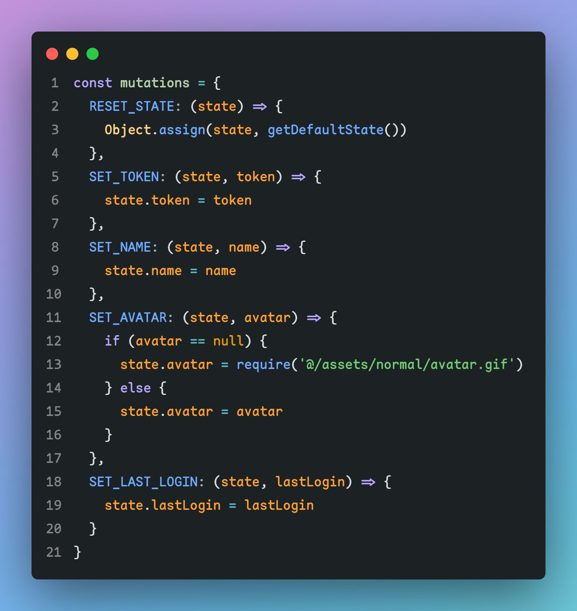
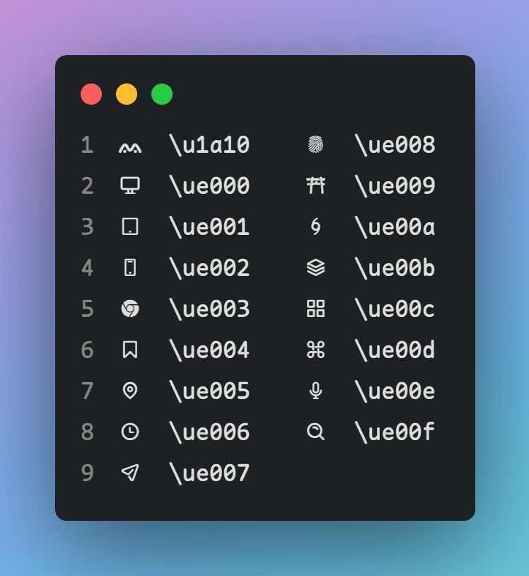
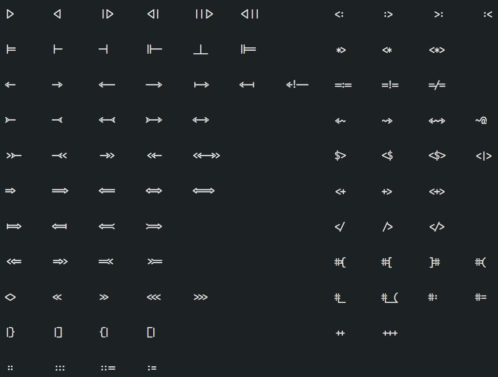

# Maple Series

version 2

## Download

release

[国内地址](https://gitee.com/subframe7536/Maple/releases/v2.0)

## only self-use

self-use monospace and sans font with round corner for coding and reading

自用的圆角等宽字体和圆角 UI 字体，用于码代码和系统/浏览器全局

## Maple Code

simplified programming font, only contains latin. some normal punctuations and arrows and customed icons

精简版的等宽字体，只有英数和一些标点，还有一些自定义的图案

- inspired by [Source Code Pro](https://github.com/adobe-fonts/source-code-pro) and [Fira Code](https://github.com/tonsky/FiraCode)

in version 2, I modify some characters' shape and use [Ligaturizer](https://github.com/ToxicFrog/Ligaturizer) to add some font ligature scripts (remake all ligature characters). And now "=>" will be correctly splited by cursor on VS Code when edit the `XML/HTML` tag

用了 Fira Code 的连字脚本，但是具体的字符全都修改过。上一版的问题已经解决。如果需要加入中文(Maple UI 的中文)可以下载 `Maple Code CN`，但是间距不是 1:2

### sample

### ligatures

## Maple Code NF

using Nerd Font to fit console characters

用于控制台的字体，没有中文和连字

### sample

## Maple UI

user interface font based on Google Sans and 中兴正圆, round the corner to look more confortable.

用圆角化的 Google Sans 英数+中兴正圆(汉仪正圆的全字库版)拼起来的字体，字比较粗，配合 Mactype，Windows 上看起来舒服一些

I use it as global font for system ([Mactype](https://github.com/snowie2000/mactype)) and browser ([Temper Monkey scripts](https://github.com/subframe7536/UserScript))

浏览器全局字体替换脚本，有些不适配的可以手动添加

### sample

## Maple hand

手写体，クレ pro 英数微调+唐美人汉字部分，目前用在手机端，相比于上一版添加了 I 和 l 的钩笔，增加辨识度

## License

Apache 2.0
