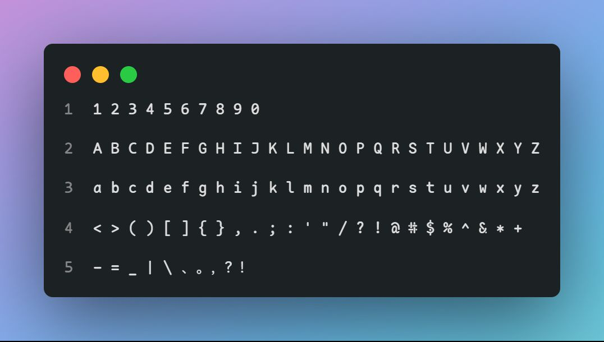
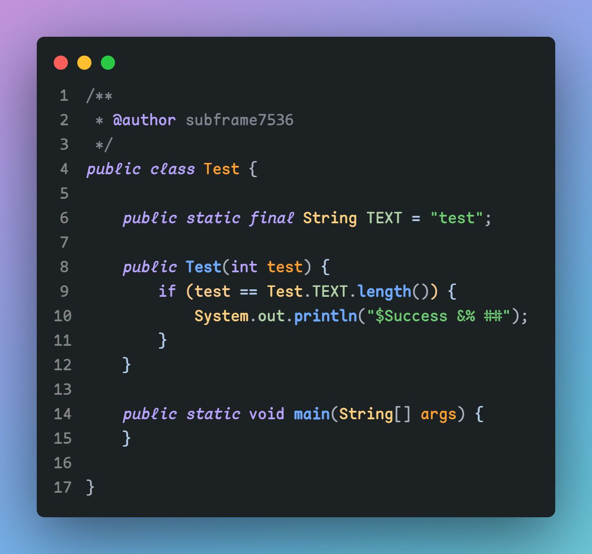

# Maple Series

version 3

## Download

release

[国内地址](https://gitee.com/subframe7536/Maple/releases/v2.0)

## Only self-use

self-use monospace and sans font with round corner for coding and reading

自用的圆角等宽字体和圆角 UI 字体，用于码代码和系统/浏览器全局

## Maple Code

simplified programming font, only contains latin. some normal punctuations, **italic** style and ligatures

精简版的等宽字体，只有英数、制表符，有连字，较于上一版加了斜体和粗体

- inspired by [Source Code Pro](https://github.com/adobe-fonts/source-code-pro), [Fira Code](https://github.com/tonsky/FiraCode), ubuntu mono, operator mono, [sarasa mono sc nerd](https://github.com/laishulu/Sarasa-Mono-SC-Nerd) and so on

Use [Ligaturizer](https://github.com/ToxicFrog/Ligaturizer) to add font ligature scripts (remake all ligature characters)

用了 Fira Code 的连字脚本，但是具体的字符全都修改过

#### usage

install regular,italic,bold,bold italic

### Maple Code CN

添加了中文字符

- 中英字符不是 2：1。原因：改了之后作为浏览器等宽字体太小，拉长高度则会破坏美观，下一版尝试一下
- 如果有需要的话，可以下载 release 中的 legacy 尝试

#### 使用

字体名称仍为 Maple Code，所以不需要安装 regular，换成安装 CN 即可

### sample

### ligatures

## Maple Code NF

using Nerd Font to fit console characters

用于控制台的字体，没有中文（一部分中文字符的 unicode 被 nerd font 占了）

### sample

## Maple UI

用圆角化的 Google Sans 英数+中兴正圆(汉仪正圆的全字库版)拼起来的字体，字比较粗

较于上一版，修复了空格宽度过宽的问题，添加了部分 kerning

Windows 使用 [Mactype](https://github.com/snowie2000/mactype) 进行全局替换，浏览器使用 [Temper Monkey scripts](https://github.com/subframe7536/UserScript) 全局字体替换，有些不适配的可以手动添加 css

### sample

## Maple hand

手写体，クレ pro 英数微调+唐美人汉字部分，目前用在手机端，相比于上一版添加了 I 和 l 的钩笔，增加辨识度

