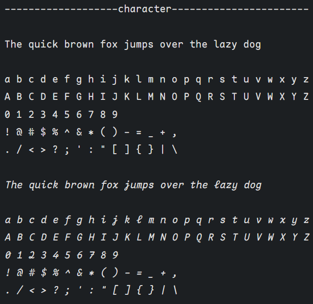
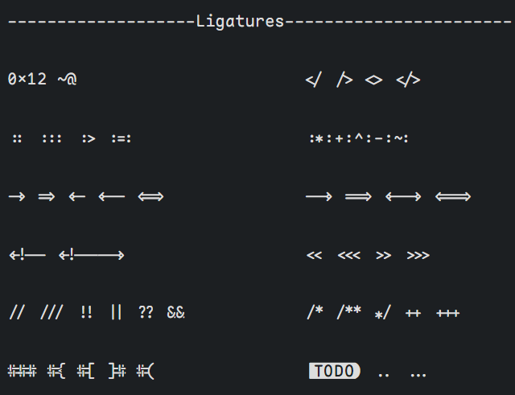
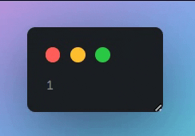
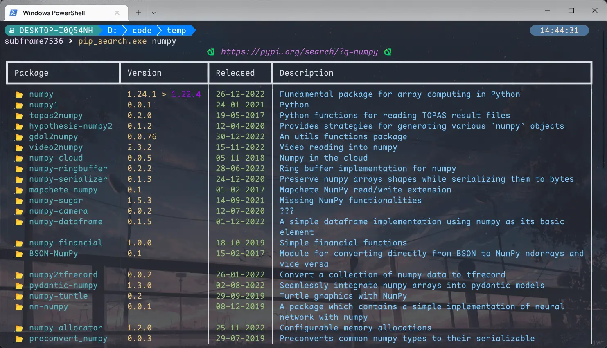
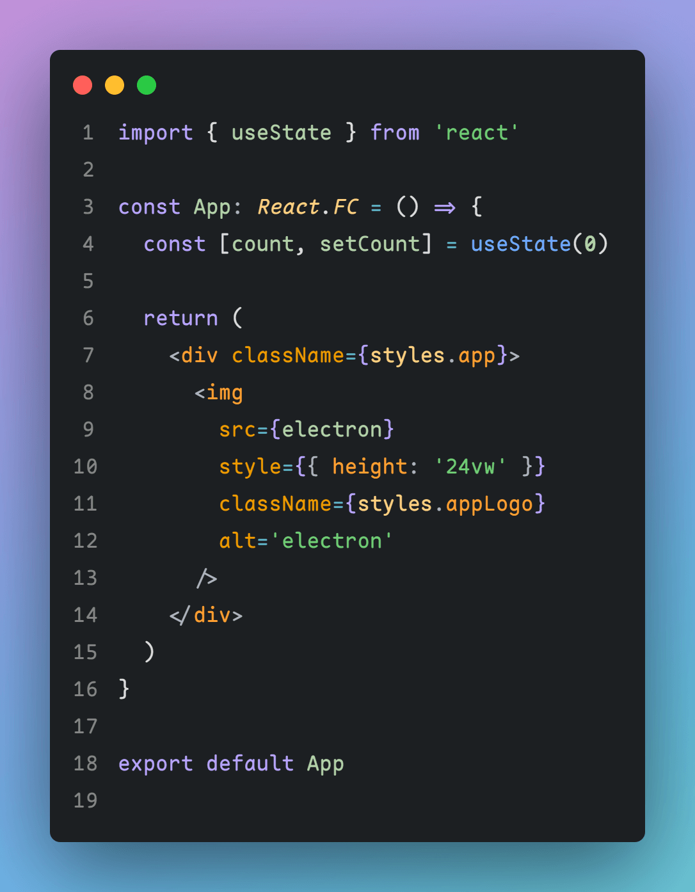
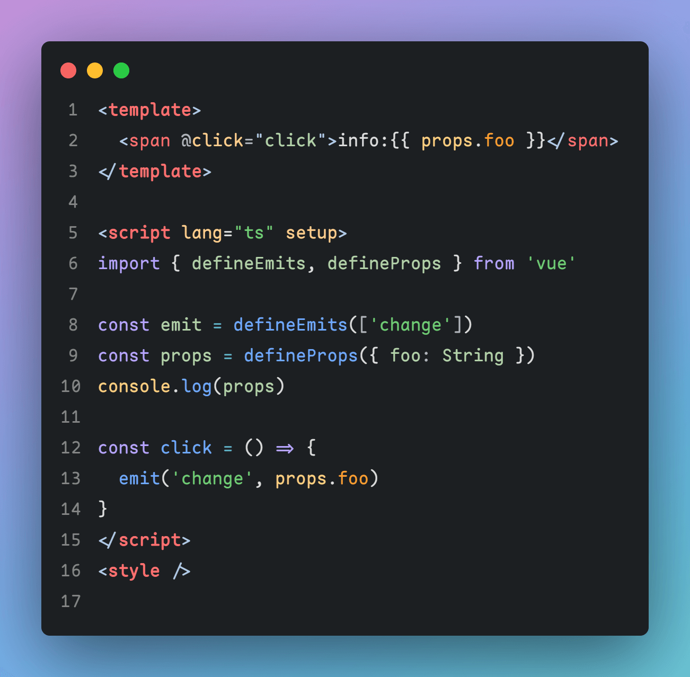
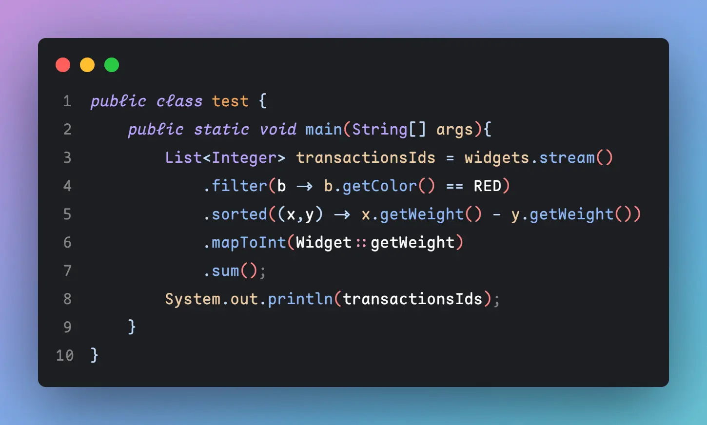
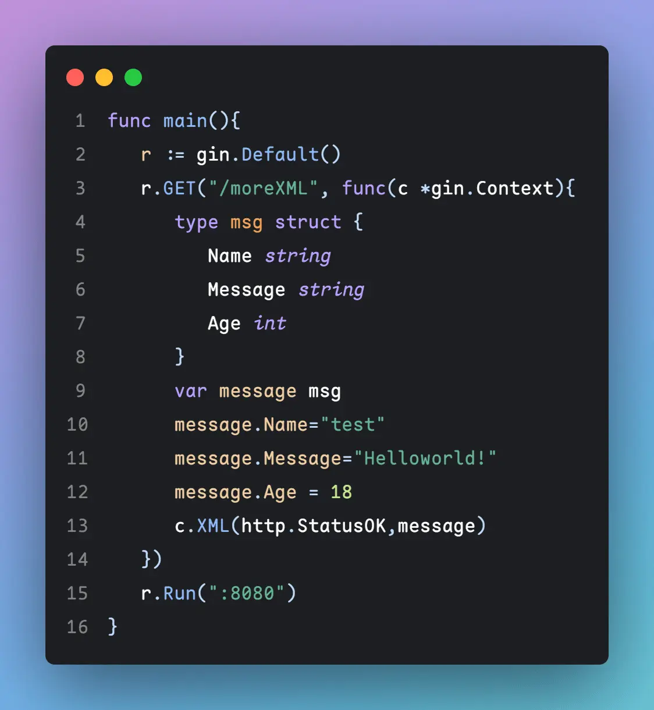
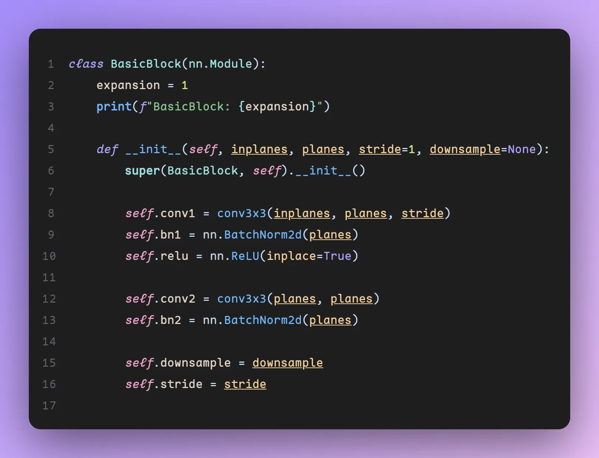
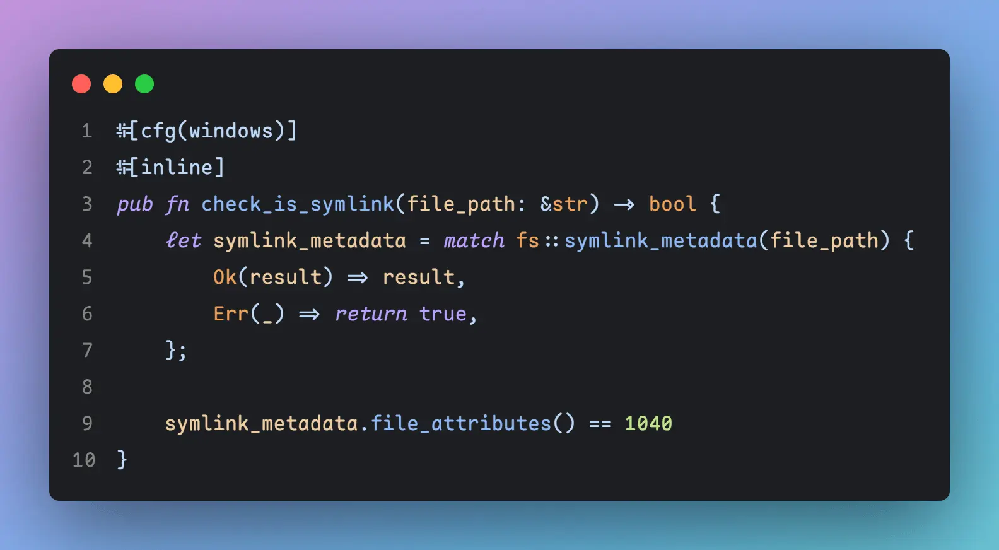

# Maple Series V5

[中文版](/README_CN.md)

## ATTENTION

Because I don't have a Mac OS machine, this is the greatest adaption I can do with Mac OS currently, but I can't test whether it works. My ability is not enough to solve other problems on Mac OS. I will record the problem and try to solve it. Feel sorry

`Maple Mono NF` now maybe can't be recognized as **Mono**, and I try my best but it doesn't work orz

## What's new compare to V4

- redesigned it according to `Fira Code Retina`'s spacing and glyph and expand the font width from 600 to 1200, which lead to a **better rendering effect** on my screen(1080P)
  - v4: 
  - v5: 
- change glyph shape for **more comfortable reading experience**
- add `..`,`...` ligature
- (v5.5) center operators `+ - * = ^ ~ < >`
- (v5.5) reduce or modify kerning, which is similar to `Jetbrains Mono`
- (v5.5) add liga exception for `/*. /**.`
- (v5.5) modify shape of italic style
- (v5.5) Thick the Bold style, add Light style
- (v5.5) resume provide `Maple Mono NF`

## What's next

in [Project](https://github.com/users/subframe7536/projects/1)

- Changes will publish in pre-release

## Download / Install

### macOS

```
brew tap homebrew/cask-fonts
brew install font-maple
```

### Other OS

Download in [releases](https://github.com/subframe7536/Maple-font/releases)

[国内地址](https://gitee.com/subframe7536/Maple/releases)

## Maple Mono

Open source rounded Monospace font

- inspired by [Source Code Pro](https://github.com/adobe-fonts/source-code-pro), [Fira Code Retina](https://github.com/tonsky/FiraCode), ubuntu mono, operator mono, [sarasa mono sc nerd](https://github.com/laishulu/Sarasa-Mono-SC-Nerd) and so on
- modify `@ # $ % &` shape
- only contains latin, table control characters and few symbols
- with **ligatures**
- **cursive** style
- `source/mono.fea`: more readable OpenType Script

### Maple Mono NF

~~Font for Cli, Maple Mono mixing Nerd Fonts~~
no longer provide, please read [Nerd Fonts Docs](https://github.com/ryanoasis/nerd-fonts#option-8-patch-your-own-font)

- I use

```shell
font-patcher -l -s --careful -c -w /path/to/ttf
```

### Sample

#### Total



#### Ligature

no `==` `===` `>=` `<=` and more ligatures with `=` for recognition




#### Cli



#### React



#### Vue



#### Java



#### Go



#### Python



#### Rust



## Dev

### usage

python fonttools

### build

```
git clone https://github.com/subframe7536/Maple-font
cd Maple-font/source
pip install fonttools
python build.py
```

## License

SIL Open Font License 1.1
