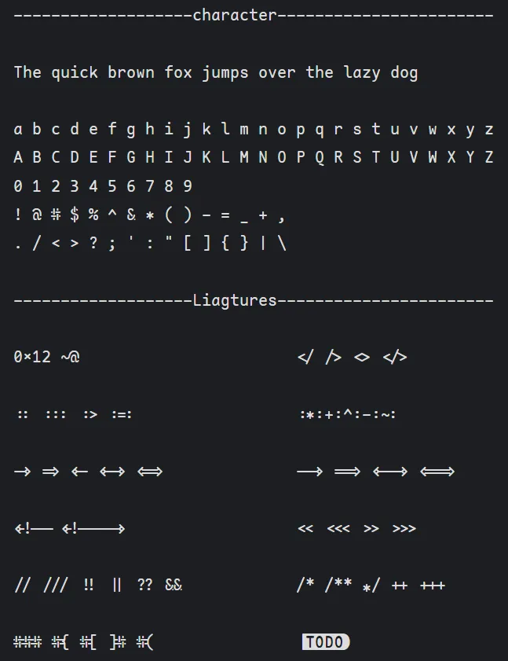
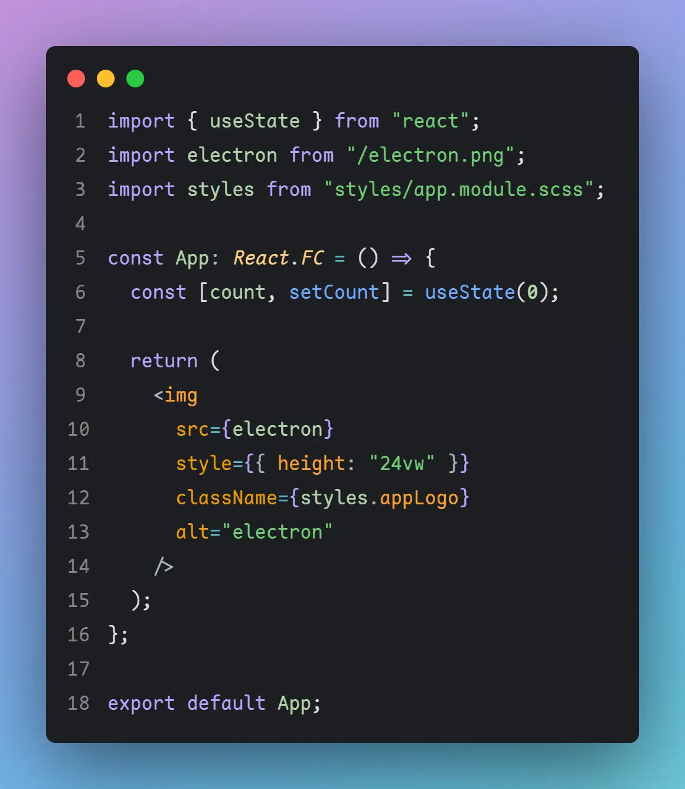
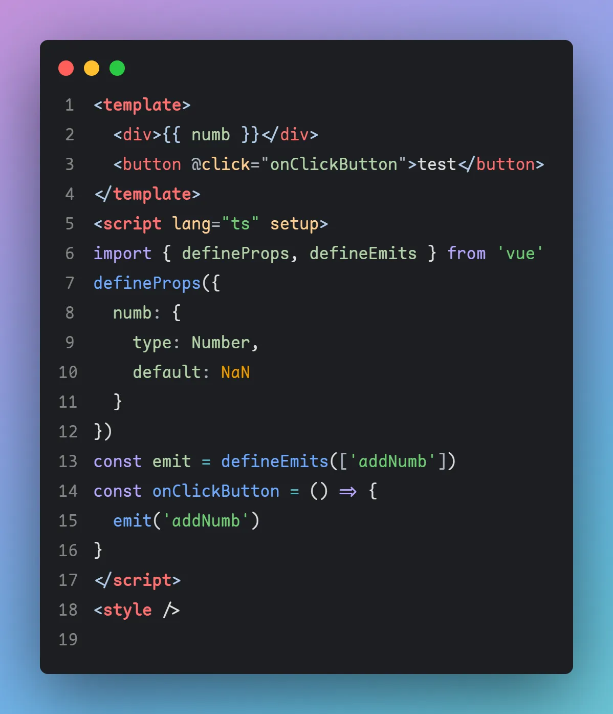
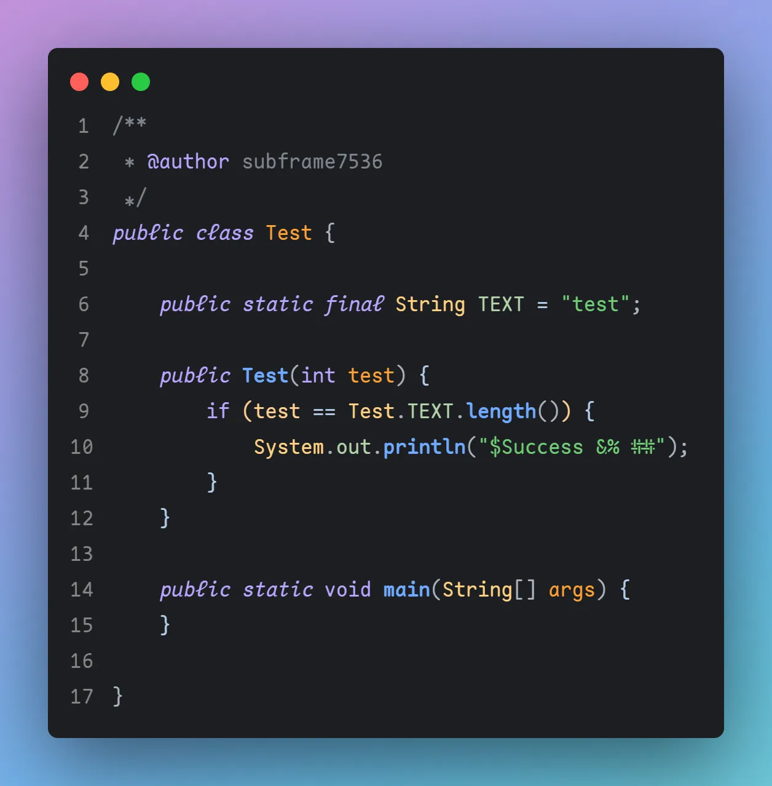
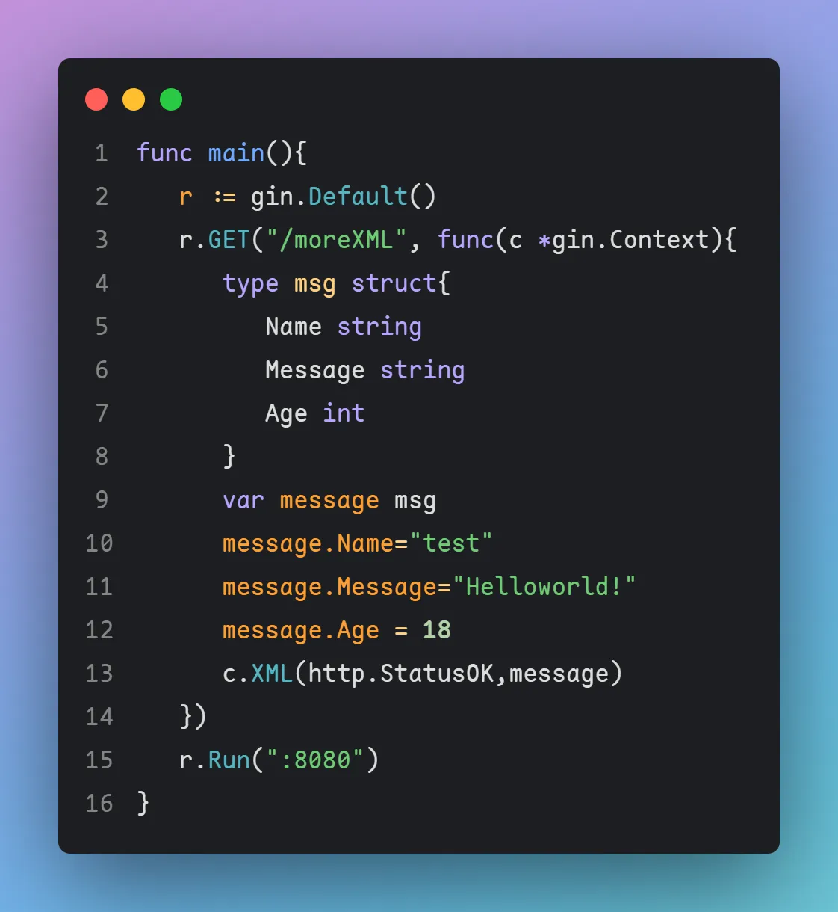
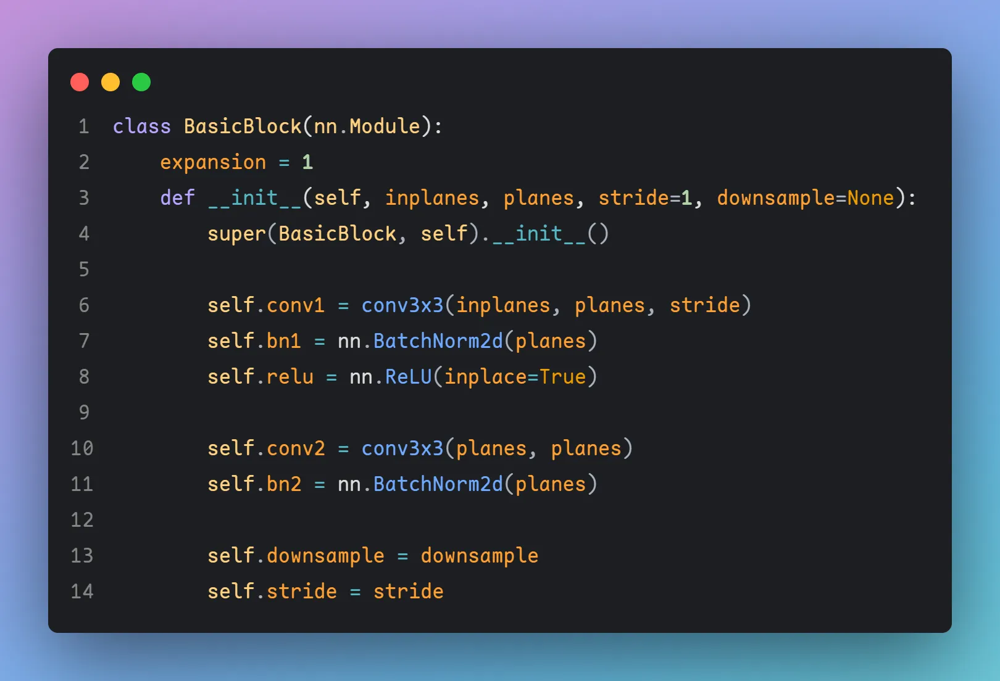
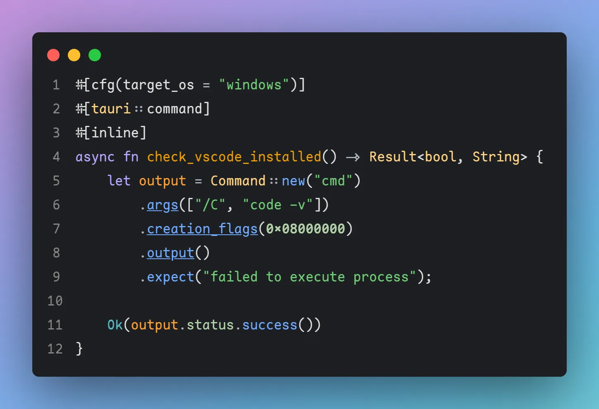

# Maple Series V4

## Download

- [国内地址](https://gitee.com/subframe7536/Maple/releases/v4.0)

## Maple Mono

开源的圆角等宽字体，只有英数、制表符和个别特殊符号

- 参考了 [Source Code Pro](https://github.com/adobe-fonts/source-code-pro), [Fira Code](https://github.com/tonsky/FiraCode), ubuntu mono, operator mono, [sarasa mono sc nerd](https://github.com/laishulu/Sarasa-Mono-SC-Nerd) 等优秀字体
- 修改了`@ # $ % &`的形状
- 有连字
- 花体的斜体
- `source/mono.fea`: 有注释的 OpenType 脚本，方便阅读

### Maple Mono NF

控制台字体，Maple Mono 混合了 [Nerd Fonts](https://github.com/ryanoasis/nerd-fonts)

### 样例

#### 全部字符




#### React



#### Vue



#### Java



#### Go



#### Python



#### Rust



#### Cli


## 开发

### 使用的模块

python fonttools

### 如何构建

```
git clone https://github.com/subframe7536/Maple-font
cd Maple-font/source
pip install fonttools
python build.py
```

## Maple UI

自改自用的字体，用的是 Google Sans 英数 + 中兴正圆的汉字，侵删

自用在 浏览器 和 Window 全局字体

Windows 使用 Mactype + [自用脚本](https://gitee.com/subframe7536/mactype) 进行全局替换，网页使用 油猴/暴力猴插件 + [scripts](https://github.com/subframe7536/UserScript) 全局字体替换，有些不适配的可以手动添加 css

- 较上一版粗暴的减小了粗细，有可能有些字形粗细不正常或错位，欢迎提 issue
- 扩大了中文引号的宽度

### 样例


## Maple Mono SC

附带 Maple UI 中文部分的 Maple Mono

### 制作原因

本来打算是不打算做 SC 版本，做 Maple UI 的斜体版本的，然后用 callback 替换的，但是我把 Maple UI 当作 Windows 全局的字体，做了斜体、安装之后不知道为啥默认的是斜体了...就很奇怪，无奈之下把它加进 Mono 中做一版 SC

### 已知问题

- 由于是用 fontforge + fonttools 自动生成的，用 Windows 字体查看器打开中文是有错位的，但是正常在 IDE 和浏览器中是可以正常显示的

  - ps: 国内是一点都没有类似的教程，还得是 Google + Github，有空的时候考虑写一篇教程

- 中英字符不是 2:1

  - 中文字符宽度为 1000，英文字符宽度为 600，2:1 只能拉长中文字符或者减少英文字符宽度
  - 减少英文字符宽度之后作为浏览器等宽字体太小，拉长高度则会破坏美观
  - 增大中文字符间距美观程度个人认为不如不改的...
  - 暂时没有解决方案，有好的想法欢迎提 issue

## Maple Hand

手写体，クレ pro 英数微调+唐美人汉字部分，目前用在手机端，配合空字体模块做全局字体模块

- 修复了 …… 的间距问题

### 样例


## 许可证

SIL Open Font License 1.1

- Maple Mono 可商用
