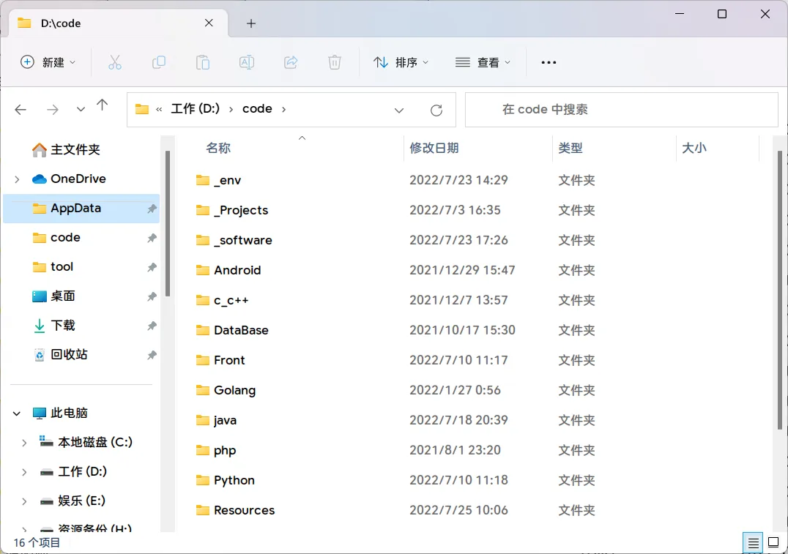
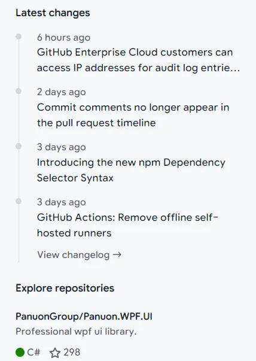

# Maple Series V5

## 注意事项

因为我没有 mac 的机子，所以目前能做的适配我都做了，但是出了问题没法测试...所以可能需要研究研究
目前有好几个问题重启解决了...
有问题欢迎提 issue

`Maple Mono NF` `Maple Mono SC NF`可能没法被识别为等宽字体，我尽力了，来个大佬吧 qwq

如果觉得字太宽，可以使用[更傻黑体 SC Nerd](https://github.com/laishulu/Sarasa-Mono-SC-Nerd)

## 下载 / 安装

### macOS

```
brew tap homebrew/cask-fonts
brew install font-maple
```

### 其他系统

从 [releases](https://github.com/subframe7536/Maple-font/releases) 下载安装

[国内地址](https://gitee.com/subframe7536/Maple/releases)

## V5 新增

- ✨ 参考`Fira Code Retina`重新设计了字形，将宽度从原来的 600 改成了 1200，应该可以提升低分屏上的渲染效果，下面是在我的屏幕(1080P)下测试的对比
  - v4: 
  - v5: 
- 优化字形，降低大写和数字的高度，提升阅读舒适度
- 添加`..`,`...`的连字，有其他需要可以提 issue
- (v5.5) 将 `+ - * = ^ ~ < >` 居中
- (v5.5) 减少间距，现在和 `Jetbrains Mono`间距类似
- (v5.5) 添加 `/*. /**.` 的连字例外
- (v5.5) 斜体样式修改
- (v5.5) 加粗粗体，添加细体
- (v5.5) 重新提供 `Maple Mono NF`

---

[Maple Mono SC NF](#maple-mono-sc-nf)

- ✨ 合并了 NF 和 SC，现在只需一个字体就可以适用所有**编码**场景，并且支持中英文 2:1
- 需要当作阅读字体请使用 Maple UI
- (半成品)支持使用其他的字体生成中文部分
- (v5.5)中文的间距也减小了，高度进行了调整

## V6 的更改

已完成的更改会发布在 Pre-Release 中，欢迎反馈

- [x] 添加 **细体** 和 **细斜体**
- [x] 加粗 **Bold** 和 **BoldItalic**
- [x] 调整字间距
- [ ] 优化字形
- [ ] 添加 v4 版的新版字形
- [ ] 任意中文字体自动生成 SC NF 的脚本

## Maple Mono

开源的圆角等宽字体，只有基础拉丁文(英数+符号)、制表符

- 参考了 [Source Code Pro](https://github.com/adobe-fonts/source-code-pro), [Fira Code](https://github.com/tonsky/FiraCode), ubuntu mono, operator mono, [sarasa mono sc nerd](https://github.com/laishulu/Sarasa-Mono-SC-Nerd) 等优秀字体
- 修改了`@ # $ % &`的形状
- 有连字
- 花体的斜体
- `source/mono.fea`: 有注释的 OpenType 脚本，方便阅读

### 样例

#### 全部字符


#### Ligature

没有`==` `===` `>=` `<=`等带着`=`的连字，当初想做这个字体就是因为 Fira Code 用起来`==`老是分辨不清


#### Cli


#### React


#### Vue


#### Java


#### Go


#### Python


#### Rust


## 开发

### 使用的模块

python fonttools

### 如何构建

```
git clone https://github.com/subframe7536/Maple-font
cd Maple-font/source
pip install fonttools
python build.py
```

## Maple Mono SC NF

中英文 2:1 + Nerd Font 控制台字体

- 在 VSCode 和 IDEA 上测试均能正常显示


## Maple UI

自改自用的字体，用的是 Google Sans 英数 + 中兴正圆的汉字，侵删

自用在 浏览器 和 Window 全局字体

Windows 使用 [noMeiryoUI](https://github.com/Tatsu-syo/noMeiryoUI) + [Mactype](https://github.com/snowie2000/mactype) + [自用脚本](https://gitee.com/subframe7536/mactype) 进行全局替换并优化渲染效果，网页使用 油猴/暴力猴插件 + [自用脚本](https://github.com/subframe7536/UserScript) 全局字体替换，有些不适配的可以手动添加 css

- 较上一版粗暴的减小了粗细，有可能有些字形粗细不正常或错位，欢迎提 issue
- 扩大了中文引号的宽度

### 样例





## Maple Hand

手写体，クレ pro 英数微调+唐美人汉字部分，目前用在手机端，配合空字体模块做全局字体模块

### 样例


## 许可证

SIL Open Font License 1.1

## 免责声明

本项目中`Maple Mono SC NF`中的汉仪正圆仅供学习与交流，本人不对使用、传播本程序及附属产物造成的任何后果承担任何责任
