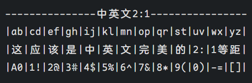

 

  

<h1 align="center"> Maple Font </h1>

带连字和圆角的等宽字体和控制台字体

  

  <a href="#安装">安装</a> |
  <a href="https://github.com/users/subframe7536/projects/1">下一步计划</a> |
  <a href="./README.md">English</a> |
  中文

## 正在测试[V7版本](https://github.com/subframe7536/maple-font/tree/variable)，下载最新版本的可变字体：[链接](https://github.com/subframe7536/maple-font/releases)

## 特性

参考了 [Source Code Pro](https://github.com/adobe-fonts/source-code-pro)、[Fira Code Retina](https://github.com/tonsky/FiraCode)、[Sarasa Mono SC Nerd](https://github.com/laishulu/Sarasa-Mono-SC-Nerd) 等优秀字体, 但是：

- 🎨 **新的形状** - 比如 `@ # $ % &` 和新的斜体样式
- 🤙🏻 **更多连字** - 比如 `.., ..., /*, /**`
- 📦 **更小的体积** - 只留下了基础拉丁文（英数 + 符号 + 基础的重音）、制表符
- 🦾 **更好的渲染效果** - 参考 `Fira Code Retina` 重新设计了字形，将宽度从原来的 600 改成了 1200，以下是在 1080p 屏幕上的对比

  |                           v4                           |                           v5                            |
  | :----------------------------------------------------: | :-----------------------------------------------------: |
  |  |  |
  |          `+` 和 `=` 在某些字号下没有居中对齐           |                 `+` 和 `=` 一直居中对齐                 |

- 🗒 **更易于阅读** - 花体斜体、优化字形、降低大写字母和数字的高度、减少字体间距、居中显示 `+ - * = ^ ~ < >`
- 🛠️ **可配置性高** - 自由开关字体特性，成为更适合你的字体
- ✨ [点击查看屏幕截图](#屏幕截图)

## 安装

### V6

| 平台/源           | 安装方法                                                                                                                                    |
| :--------------- | :------------------------------------------------------------------------------------------------------------------------------------------- |
| macOS            | `brew install --cask font-maple`                                                                                                             |
| Arch Linux AUR   | `paru -S ttf-maple`                                                                                                                          |
| ArchLinuxCN Repo | `sudo pacman -S ttf-maple`                                                                                                                   |
| Others           | 从 [releases](https://github.com/subframe7536/Maple-font/releases/v6.4) 中下载安装，[国内地址](https://gitee.com/subframe7536/Maple/releases)|

### V7 Beta

| 平台/源        | 安装方法                 |
| :------------- | :----------------------- |
| Arch Linux AUR | `paru -S ttf-maple-beta` |

## 注意事项

因为我没有 mac 的机子，所以目前能做的适配我都做了，但是出了问题没法测试... 所以可能需要研究研究
目前有好几个问题重启解决了... 有问题欢迎提 issue

`Maple Mono NF, Maple Mono SC NF` 可能没法被识别为等宽字体，我尽力了，来个大佬吧 qwq

如果觉得字太宽，可以使用 [更纱黑体 SC Nerd](https://github.com/laishulu/Sarasa-Mono-SC-Nerd)

## 字形总览

 
 
 
多种方式打出TODO标签 
注：在jetbrains全家桶中, [todo)不能正确渲染, 所以请用todo))

 
<h3 align="center">在 V7 中，字体特性有一些改变，详见 <a href="https://github.com/subframe7536/maple-font/tree/variable?tab=readme-ov-file#features">文档</h3> 
兼容性和使用方法 <a href="https://github.com/tonsky/FiraCode#editor-compatibility-list" target="_blank">FiraCode README</a>

## 屏幕截图

代码主题: [vscode-theme-maple](https://github.com/subframe7536/vscode-theme-maple)

由 [VSCodeSnap](https://github.com/luisllamasbinaburo/VSCodeSnap) 生成

<b>命令行（点击展开！）</b>

<b>React</b>

<b>Vue</b>

<b>Java</b>

<b>Go</b>

  

<b>Python</b>

<b>Rust</b>

## 构建

见 [文档（英文）](./source/README.md)

## Maple Mono SC NF

- ✨ 合并了 Nerd Font 和 中文字体，现在只需一个字体就可以适用所有**编码**场景
- ✨ 中英文 2:1
- 在 VSCode 和 IDEA 上测试均能正常显示
- 支持使用其他的字体生成中文部分
- 减小中文间距并调整高度，使之看起来更协调
  - 由于美观因素，VSCode中自动换行会错位，请谅解
- V6版本中文采用[资源圆体](https://github.com/CyanoHao/Resource-Han-Rounded)（OFL证书）而不是V5的汉仪正圆，整个字体都可任意修改、商用
- 需要当作阅读字体请使用 Maple UI

  

### 构建

见 [文档（中文）](https://github.com/subframe7536/maple-font/blob/chinese/source/README_CN.md)

## Maple UI

> 自改自用的字体，用的是 Google Sans 英数改圆角 + 汉仪正圆的汉字，侵删

- Windows 使用 [noMeiryoUI](https://github.com/Tatsu-syo/noMeiryoUI) + [MacType](https://github.com/snowie2000/mactype) + [自用脚本](https://github.com/subframe7536/maple-font/tree/other-resources/cn-resource/mactype) 进行全局替换并优化渲染效果
- 网页使用 油猴/暴力猴插件 + [自用脚本](https://github.com/subframe7536/UserScript) 全局字体替换，有些不适配的可以手动添加 css
- 较上一版粗暴的减小了粗细，有可能有些字形粗细不正常或错位，欢迎提 issue
- 扩大了中文引号的宽度

  

### 下载地址

[Maple UI](https://github.com/subframe7536/maple-font/tree/other-resources/cn-resource/maple-ui)

## Maple Hand

手写体，クレ pro 英数微调 + 汉仪唐美人 + 方正大签字笔体，目前用在手机端，做全局字体模块

  

### 下载地址

[Maple Hand](https://github.com/subframe7536/maple-font/tree/other-resources/cn-resource/maple-hand)

## 捐赠

如果对你产生了帮助，欢迎任意金额的打赏

## 许可证

SIL Open Font License 1.1

## 免责声明

本项目中V5版本的 `Maple Mono SC NF` 中的汉仪正圆仅供学习与交流，本人不对使用、传播本程序及附属产物造成的任何后果承担任何责任
