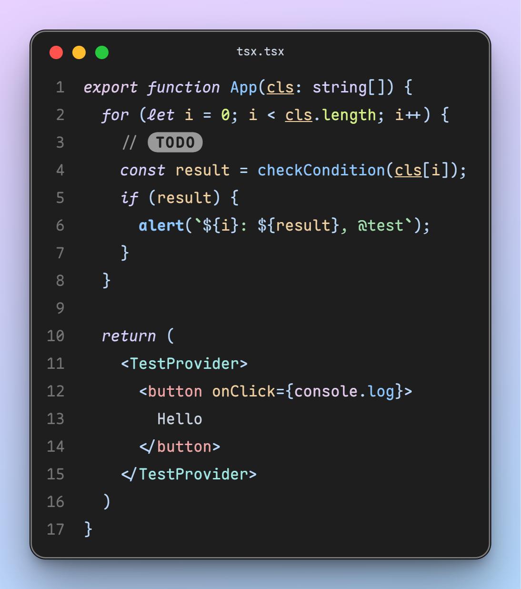

<p align="center">
  <a href="https://trendshift.io/repositories/13165" target="_blank"></a>
  <a href="https://hellogithub.com/repository/0601f355bd824d88b58f1af3066c486a" target="_blank"></a>
</p>
<p align="center">
  
  
  
</p>
<p align="center">
  
  
  
  
</p>


<p align="center">
  <a href="#ダウンロード">ダウンロード</a> |
  <a href="https://font.subf.dev">ウェブサイト</a> |
  <a href="./README.md">English</a> |
  <a href="./README_CN.md">中文</a> |
  日本語
</p>

# Maple Mono

Maple Mono は、コーディングの流れをスムーズにすることに焦点を当てたオープンソースのモノスペースフォントです。

私は自分の作業体験を向上させるためにこれを作成し、他の人にも役立つことを願っています。

V7 は完全に再作成されたバージョンで、可変フォント形式とフォントプロジェクトのソースファイルを提供し、半数以上のグリフを再設計し、よりスマートなリガチャを提供します。V6 は[こちら](https://github.com/subframe7536/maple-font/tree/main)で確認できます。

## 特徴

- ✨ 可変 - 無限のフォントウェイトと細かく調整されたイタリックグリフ。
- ☁️ スムーズ - 丸い角、`@ $ % & Q ->` の新しいグリフ、イタリックスタイルの筆記体 `f i j k l x y` 。
- 💪 実用的 - 大量のスマートリガチャ、詳細は[`features/`](./source/features/README.md)を参照。
- 🎨 アイコン - 一流の[Nerd-Font](https://github.com/ryanoasis/nerd-fonts)サポート、ターミナルをより鮮やかに。
- 🔨 カスタマイズ - フォント機能を自由に有効または無効にして、自分だけのフォントを作成。

### 簡体字中国語、繁体字中国語、日本語

CN バージョンは[Resource Han Rounded](https://github.com/CyanoHao/Resource-Han-Rounded)に基づいており、簡体字中国語、繁体字中国語、日本語の開発環境に完全な文字セットサポートを提供します。同時に、中国語と英語の 2:1 の完璧な整列の特性により、このフォントは多言語表示や Markdown テーブルなどのシナリオで整然とした、統一された、美しく快適な外観を実現します。ただし、中国語の文字間隔は他の人気のある中国語フォントと比較して大きくなっています。詳細は[リリースノート](https://github.com/subframe7536/maple-font/releases/tag/cn-base)および[この問題](https://github.com/subframe7536/maple-font/issues/211)を参照してください。


## スクリーンショット



- [CodeImg](https://github.com/subframe7536/vscode-codeimg)で撮影
- テーマ：[Maple](https://github.com/subframe7536/vscode-theme-maple)
- 設定：フォントサイズ 16px、行の高さ 1.8、デフォルトの文字間隔

## ダウンロード

すべてのフォントアーカイブは[リリース](https://github.com/subframe7536/maple-font/releases)からダウンロードできます。

### Scoop (Windows)

```sh
# バケットを追加
scoop bucket add nerd-fonts
# Maple Mono (ttf 形式)
scoop install Maple-Mono
# Maple Mono NF
scoop install Maple-Mono-NF
# Maple Mono NF CN
scoop install Maple-Mono-NF-CN
```

<details>
  <summary>すべてのパッケージ (クリックして展開)</summary>

  ```sh
  # バケットを追加
  scoop bucket add nerd-fonts
  # Maple Mono (ttf 形式)
  scoop install Maple-Mono
  # Maple Mono (hinted ttf 形式)
  scoop install Maple-Mono-autohint
  # Maple Mono (otf 形式)
  scoop install Maple-Mono-otf
  # Maple Mono NF
  scoop install Maple-Mono-NF
  # Maple Mono NF CN
  scoop install Maple-Mono-NF-CN
  ```

</details>

### Homebrew (MacOS, Linux)

```sh
# Maple Mono
brew install --cask font-maple-mono
# Maple Mono NF
brew install --cask font-maple-mono-nf
# Maple Mono NF CN
brew install --cask font-maple-mono-nf-cn
```

<details>
  <summary>すべてのパッケージ (クリックして展開)</summary>

  ```sh
  # Maple Mono
  brew install --cask font-maple-mono
  # Maple Mono NF
  brew install --cask font-maple-mono-nf
  # Maple Mono CN
  brew install --cask font-maple-mono-cn
  # Maple Mono NF CN
  brew install --cask font-maple-mono-nf-cn

  # Maple Mono Normal
  brew install --cask font-maple-mono-normal
  # Maple Mono Normal NF
  brew install --cask font-maple-mono-normal-nf
  # Maple Mono Normal CN
  brew install --cask font-maple-mono-normal-cn
  # Maple Mono Normal NF CN
  brew install --cask font-maple-mono-normal-nf-cn
  ```

</details>

### Arch Linux

ArchLinuxCN リポジトリでは、pkgbase 内のすべてのパッケージ zip ファイルをダウンロードせずに、単一のパッケージ zip ファイルをダウンロードできますが、AUR ではできません。(良い解決策がある場合は、Cyberczy(czysheep@gmail.com) までご連絡ください)

#### ArchLinuxCN (推奨)

```sh
# Maple Mono (Ligature TTF unhinted)
paru -S ttf-maplemono
# Maple Mono NF (Ligature unhinted)
paru -S ttf-maplemono-nf-unhinted
# Maple Mono NF CN (Ligature unhinted)
paru -S ttf-maplemono-nf-cn-unhinted
```

<details>
  <summary>すべてのパッケージ (クリックして展開)</summary>

  ```sh
  # Maple Mono (Ligature Variable)
  paru -S ttf-maplemono-variable
  # Maple Mono (Ligature TTF hinted)
  paru -S ttf-maplemono-autohint
  # Maple Mono (Ligature TTF unhinted)
  paru -S ttf-maplemono
  # Maple Mono (Ligature OTF)
  paru -S otf-maplemono
  # Maple Mono (Ligature WOFF2)
  paru -S woff2-maplemono
  # Maple Mono NF (Ligature hinted)
  paru -S ttf-maplemono-nf
  # Maple Mono NF (Ligature unhinted)
  paru -S ttf-maplemono-nf-unhinted
  # Maple Mono CN (Ligature hinted)
  paru -S ttf-maplemono-cn
  # Maple Mono CN (Ligature unhinted)
  paru -S ttf-maplemono-cn-unhinted
  # Maple Mono NF CN (Ligature hinted)
  paru -S ttf-maplemono-nf-cn
  # Maple Mono NF CN (Ligature unhinted)
  paru -S ttf-maplemono-nf-cn-unhinted

  # Maple Mono (No-Ligature Variable)
  paru -S ttf-maplemononl-variable
  # Maple Mono (No-Ligature TTF hinted)
  paru -S ttf-maplemononl-autohint
  # Maple Mono (No-Ligature TTF unhinted)
  paru -S ttf-maplemononl
  # Maple Mono (No-Ligature OTF)
  paru -S otf-maplemononl
  # Maple Mono (No-Ligature WOFF2)
  paru -S woff2-maplemononl
  # Maple Mono NF (No-Ligature hinted)
  paru -S ttf-maplemononl-nf
  # Maple Mono NF (No-Ligature unhinted)
  paru -S ttf-maplemononl-nf-unhinted
  # Maple Mono CN (No-Ligature hinted)
  paru -S ttf-maplemononl-cn
  # Maple Mono CN (No-Ligature unhinted)
  paru -S ttf-maplemononl-cn-unhinted
  # Maple Mono NF CN (No-Ligature hinted)
  paru -S ttf-maplemononl-nf-cn
  # Maple Mono NF CN (No-Ligature unhinted)
  paru -S ttf-maplemononl-nf-cn-unhinted

  # Maple Mono Normal (Ligature Variable)
  paru -S ttf-maplemononormal-variable
  # Maple Mono Normal (Ligature TTF hinted)
  paru -S ttf-maplemononormal-autohint
  # Maple Mono Normal (Ligature TTF unhinted)
  paru -S ttf-maplemononormal
  # Maple Mono Normal (Ligature OTF)
  paru -S otf-maplemononormal
  # Maple Mono Normal (Ligature WOFF2)
  paru -S woff2-maplemononormal
  # Maple Mono Normal NF (Ligature hinted)
  paru -S ttf-maplemononormal-nf
  # Maple Mono Normal NF (Ligature unhinted)
  paru -S ttf-maplemononormal-nf-unhinted
  # Maple Mono Normal CN (Ligature hinted)
  paru -S ttf-maplemononormal-cn
  # Maple Mono Normal CN (Ligature unhinted)
  paru -S ttf-maplemononormal-cn-unhinted
  # Maple Mono Normal NF CN (Ligature hinted)
  paru -S ttf-maplemononormal-nf-cn
  # Maple Mono Normal NF CN (Ligature unhinted)
  paru -S ttf-maplemononormal-nf-cn-unhinted

  # Maple Mono Normal (No-Ligature Variable)
  paru -S ttf-maplemononormalnl-variable
  # Maple Mono Normal (No-Ligature TTF hinted)
  paru -S ttf-maplemononormalnl-autohint
  # Maple Mono Normal (No-Ligature TTF unhinted)
  paru -S ttf-maplemononormalnl
  # Maple Mono Normal (No-Ligature OTF)
  paru -S otf-maplemononormalnl
  # Maple Mono Normal (No-Ligature WOFF2)
  paru -S woff2-maplemononormalnl
  # Maple Mono Normal NF (No-Ligature hinted)
  paru -S ttf-maplemononormalnl-nf
  # Maple Mono Normal NF (No-Ligature unhinted)
  paru -S ttf-maplemononormalnl-nf-unhinted
  # Maple Mono Normal CN (No-Ligature hinted)
  paru -S ttf-maplemononormalnl-cn
  # Maple Mono Normal CN (No-Ligature unhinted)
  paru -S ttf-maplemononormalnl-cn-unhinted
  # Maple Mono Normal NF CN (No-Ligature hinted)
  paru -S ttf-maplemononormalnl-nf-cn
  # Maple Mono Normal NF CN (No-Ligature unhinted)
  paru -S ttf-maplemononormalnl-nf-cn-unhinted
  ```

</details>

#### AUR (非推奨)

```sh
# Maple Mono (Ligature TTF unhinted)
paru -S maplemono-ttf
# Maple Mono NF (Ligature unhinted)
paru -S maplemono-nf-unhinted
# Maple Mono NF CN (Ligature unhinted)
paru -S maplemono-nf-cn-unhinted
```

<details>
  <summary>すべてのパッケージ (クリックして展開)</summary>

  ```sh
  # Maple Mono (Ligature Variable)
  paru -S maplemono-variable
  # Maple Mono (Ligature TTF hinted)
  paru -S maplemono-ttf-autohint
  # Maple Mono (Ligature TTF unhinted)
  paru -S maplemono-ttf
  # Maple Mono (Ligature OTF)
  paru -S maplemono-otf
  # Maple Mono (Ligature WOFF2)
  paru -S maplemono-woff2
  # Maple Mono NF (Ligature hinted)
  paru -S maplemono-nf
  # Maple Mono NF (Ligature unhinted)
  paru -S maplemono-nf-unhinted
  # Maple Mono CN (Ligature hinted)
  paru -S maplemono-cn
  # Maple Mono CN (Ligature unhinted)
  paru -S maplemono-cn-unhinted
  # Maple Mono NF CN (Ligature hinted)
  paru -S maplemono-nf-cn
  # Maple Mono NF CN (Ligature unhinted)
  paru -S maplemono-nf-cn-unhinted

  # Maple Mono (No-Ligature Variable)
  paru -S maplemononl-variable
  # Maple Mono (No-Ligature TTF hinted)
  paru -S maplemononl-ttf-autohint
  # Maple Mono (No-Ligature TTF unhinted)
  paru -S maplemononl-ttf
  # Maple Mono (No-Ligature OTF)
  paru -S maplemononl-otf
  # Maple Mono (No-Ligature WOFF2)
  paru -S maplemononl-woff2
  # Maple Mono NF (No-Ligature hinted)
  paru -S maplemononl-nf
  # Maple Mono NF (No-Ligature unhinted)
  paru -S maplemononl-nf-unhinted
  # Maple Mono CN (No-Ligature hinted)
  paru -S maplemononl-cn
  # Maple Mono CN (No-Ligature unhinted)
  paru -S maplemononl-cn-unhinted
  # Maple Mono NF CN (No-Ligature hinted)
  paru -S maplemononl-nf-cn
  # Maple Mono NF CN (No-Ligature unhinted)
  paru -S maplemononl-nf-cn-unhinted

  # Maple Mono Normal (Ligature Variable)
  paru -S maplemononormal-variable
  # Maple Mono Normal (Ligature TTF hinted)
  paru -S maplemononormal-ttf-autohint
  # Maple Mono Normal (Ligature TTF unhinted)
  paru -S maplemononormal-ttf
  # Maple Mono Normal (Ligature OTF)
  paru -S maplemononormal-otf
  # Maple Mono Normal (Ligature WOFF2)
  paru -S maplemononormal-woff2
  # Maple Mono Normal NF (Ligature hinted)
  paru -S maplemononormal-nf
  # Maple Mono Normal NF (Ligature unhinted)
  paru -S maplemononormal-nf-unhinted
  # Maple Mono Normal CN (Ligature hinted)
  paru -S maplemononormal-cn
  # Maple Mono Normal CN (Ligature unhinted)
  paru -S maplemononormal-cn-unhinted
  # Maple Mono Normal NF CN (Ligature hinted)
  paru -S maplemononormal-nf-cn
  # Maple Mono Normal NF CN (Ligature unhinted)
  paru -S maplemononormal-nf-cn-unhinted

  # Maple Mono Normal (No-Ligature Variable)
  paru -S maplemononormalnl-variable
  # Maple Mono Normal (No-Ligature TTF hinted)
  paru -S maplemononormalnl-ttf-autohint
  # Maple Mono Normal (No-Ligature TTF unhinted)
  paru -S maplemononormalnl-ttf
  # Maple Mono Normal (No-Ligature OTF)
  paru -S maplemononormalnl-otf
  # Maple Mono Normal (No-Ligature WOFF2)
  paru -S maplemononormalnl-woff2
  # Maple Mono Normal NF (No-Ligature hinted)
  paru -S maplemononormalnl-nf
  # Maple Mono Normal NF (No-Ligature unhinted)
  paru -S maplemononormalnl-nf-unhinted
  # Maple Mono Normal CN (No-Ligature hinted)
  paru -S maplemononormalnl-cn
  # Maple Mono Normal CN (No-Ligature unhinted)
  paru -S maplemononormalnl-cn-unhinted
  # Maple Mono Normal NF CN (No-Ligature hinted)
  paru -S maplemononormalnl-nf-cn
  # Maple Mono Normal NF CN (No-Ligature unhinted)
  paru -S maplemononormalnl-nf-cn-unhinted
  ```

</details>

### Nixpkgs (NixOS, Linux, MacOS)

```nix
fonts.packages = with pkgs; [
  # Maple Mono (Ligature TTF unhinted)
  maple-mono.truetype
  # Maple Mono NF (Ligature unhinted)
  maple-mono.NF-unhinted
  # Maple Mono NF CN (Ligature unhinted)
  maple-mono.NF-CN-unhinted
];
```

<details>
  <summary>すべてのパッケージ (クリックして展開)</summary>

  ```nix
  fonts.packages = with pkgs; [
    # Maple Mono (Ligature Variable)
    maple-mono.variable
    # Maple Mono (Ligature TTF hinted)
    maple-mono.truetype-autohint
    # Maple Mono (Ligature TTF unhinted)
    maple-mono.truetype
    # Maple Mono (Ligature OTF)
    maple-mono.opentype
    # Maple Mono (Ligature WOFF2)
    maple-mono.woff2
    # Maple Mono NF (Ligature hinted)
    maple-mono.NF
    # Maple Mono NF (Ligature unhinted)
    maple-mono.NF-unhinted
    # Maple Mono CN (Ligature hinted)
    maple-mono.CN
    # Maple Mono CN (Ligature unhinted)
    maple-mono.CN-unhinted
    # Maple Mono NF CN (Ligature hinted)
    maple-mono.NF-CN
    # Maple Mono NF CN (Ligature unhinted)
    maple-mono.NF-CN-unhinted

    # Maple Mono (No-Ligature Variable)
    maple-mono.NL-Variable
    # Maple Mono (No-Ligature TTF hinted)
    maple-mono.NL-TTF-AutoHint
    # Maple Mono (No-Ligature TTF unhinted)
    maple-mono.NL-TTF
    # Maple Mono (No-Ligature OTF)
    maple-mono.NL-OTF
    # Maple Mono (No-Ligature WOFF2)
    maple-mono.NL-Woff2
    # Maple Mono NF (No-Ligature hinted)
    maple-mono.NL-NF
    # Maple Mono NF (No-Ligature unhinted)
    maple-mono.NL-NF-unhinted
    # Maple Mono CN (No-Ligature hinted)
    maple-mono.NL-CN
    # Maple Mono CN (No-Ligature unhinted)
    maple-mono.NL-CN-unhinted
    # Maple Mono NF CN (No-Ligature hinted)
    maple-mono.NL-NF-CN
    # Maple Mono NF CN (No-Ligature unhinted)
    maple-mono.NL-NF-CN-unhinted

    # Maple Mono Normal (Ligature Variable)
    maple-mono.Normal-Variable
    # Maple Mono Normal (Ligature TTF hinted)
    maple-mono.Normal-TTF-AutoHint
    # Maple Mono Normal (Ligature TTF unhinted)
    maple-mono.Normal-TTF
    # Maple Mono Normal (Ligature OTF)
    maple-mono.Normal-OTF
    # Maple Mono Normal (Ligature WOFF2)
    maple-mono.Normal-Woff2
    # Maple Mono Normal NF (Ligature hinted)
    maple-mono.Normal-NF
    # Maple Mono Normal NF (Ligature unhinted)
    maple-mono.Normal-NF-unhinted
    # Maple Mono Normal CN (Ligature hinted)
    maple-mono.Normal-CN
    # Maple Mono Normal CN (Ligature unhinted)
    maple-mono.Normal-CN-unhinted
    # Maple Mono Normal NF CN (Ligature hinted)
    maple-mono.Normal-NF-CN
    # Maple Mono Normal NF CN (Ligature unhinted)
    maple-mono.Normal-NF-CN-unhinted

    # Maple Mono Normal (No-Ligature Variable)
    maple-mono.NormalNL-Variable
    # Maple Mono Normal (No-Ligature TTF hinted)
    maple-mono.NormalNL-TTF-AutoHint
    # Maple Mono Normal (No-Ligature TTF unhinted)
    maple-mono.NormalNL-TTF
    # Maple Mono Normal (No-Ligature OTF)
    maple-mono.NormalNL-OTF
    # Maple Mono Normal (No-Ligature WOFF2)
    maple-mono.NormalNL-Woff2
    # Maple Mono Normal NF (No-Ligature hinted)
    maple-mono.NormalNL-NF
    # Maple Mono Normal NF (No-Ligature unhinted)
    maple-mono.NormalNL-NF-unhinted
    # Maple Mono Normal CN (No-Ligature hinted)
    maple-mono.NormalNL-CN
    # Maple Mono Normal CN (No-Ligature unhinted)
    maple-mono.NormalNL-CN-unhinted
    # Maple Mono Normal NF CN (No-Ligature hinted)
    maple-mono.NormalNL-NF-CN
    # Maple Mono Normal NF CN (No-Ligature unhinted)
    maple-mono.NormalNL-NF-CN-unhinted
  ];
  ```

</details>

## CDN

### Maple Mono

- [fontsource](https://fontsource.org/fonts/maple-mono)
- [ZeoSeven Fonts](https://fonts.zeoseven.com/items/443/)

### Maple Mono CN

- [The Chinese Web Fonts Plan (中文网字计划)](https://chinese-font.netlify.app/zh-cn/fonts/maple-mono-cn/MapleMono-CN-Regular)
- [ZeoSeven Fonts](https://fonts.zeoseven.com/items/442/)

## 使用方法 & 特性設定

[ドキュメント](./source/features/README.md)を参照するか、[プレイグラウンド](https://font.subf.dev/en/playground)で試してください。

## 命名に関する FAQ

### 特徴

- **Ligature**: リガチャ付きのデフォルトバージョン（`Maple Mono`）
- **No-Ligature**: リガチャなしのデフォルトバージョン（`Maple Mono NL`）
- **Normal-Ligature**: リガチャ付きの[`--normal` プリセット](#preset)（`Maple Mono Normal`）
- **Normal-No-Ligature**: リガチャなしの[`--normal` プリセット](#preset)（`Maple Mono Normal NL`）

### フォーマットとグリフセット

- **Variable**: 最小バージョン、可変でフォントウェイトをスムーズに変更
- **TTF**: 最小バージョン、ttf 形式 [推奨！]
- **OTF**: 最小バージョン、otf 形式
- **WOFF2**: 最小バージョン、woff2 形式、ウェブページでの小サイズ用
- **NF**: Nerd-Font パッチバージョン、ターミナルにアイコンを追加（`-NF` サフィックス付き）
- **CN**: 中国語バージョン、中国語と日本語のグリフを埋め込む（`-CN` サフィックス付き）
- **NF-CN**: フルバージョン、アイコン、中国語、日本語のグリフを埋め込む（`-NF-CN` サフィックス付き）

### フォントヒント

- **Hinted フォント**は、低解像度の画面でより良いレンダリング効果を得るために使用されます。私の経験から、画面解像度が 1080P 以下または同等の場合、"hinted フォント"を使用することをお勧めします。"unhinted フォント"を使用すると、テキストのずれや厚さの不均一が発生します。
  - この場合、`MapleMono-TTF-AutoHint` / `MapleMono-NF` / `MapleMono-NF-CN` などを選択できます。
- **Unhinted フォント**は、高解像度の画面（例：MacBook）で使用されます。"hinted フォント"を使用すると、テキストがぼやけたり、奇妙に見えたりします。
  - この場合、`MapleMono-OTF` / `MapleMono-TTF` / `MapleMono-NF-unhinted` / `MapleMono-NF-CN-unhinted` などを選択できます。
- なぜ `-AutoHint` と `-unhinted` サフィックスが存在するのですか？
  - 後方互換性のために、元の命名スキームを保持しています。`-AutoHint` は `TTF` 形式にのみ使用されます。

## カスタムビルド

[`config.json`](./config.json)ファイルはビルドプロセスを構成するために使用されます。詳細については、[スキーマ](./source/schema.json)または[ドキュメント](./source/features/README.md)を参照してください。

ビルドプロセスをカスタマイズするための[コマンドラインオプション](#build-script-usage)もいくつかあります。CLI オプションは `config.json` のオプションよりも優先されます。

### ブラウザで構築する

[プレイグラウンド](https://font.subf.dev/en/playground)に行く，左下隅の「Custom Build」ボタンをクリックしてください

### Github Actions を使用する

[Github Actions](https://github.com/subframe7536/maple-font/actions/workflows/custom.yml)を使用してフォントをビルドできます。

1. リポジトリをフォークする
2. （オプション） `config.json` の内容を変更する
3. Actions タブに移動する
4. 左側の `Custom Build` メニュー項目をクリックする
5. オプションを設定して `Run workflow` ボタンをクリックする
6. ビルドが完了するのを待つ
7. リリースからフォントアーカイブをダウンロードする

### Docker を使用する

```shell
git clone https://github.com/subframe7536/maple-font --depth 1 -b variable
docker build -t maple-font .
docker run -v "$(pwd)/fonts:/app/fonts" -e BUILD_ARGS="--normal" maple-font
```

### ローカルビルド

リポジトリをクローンし、ローカルマシンで実行します。`python3` と `pip` がインストールされていることを確認してください。

```shell
git clone https://github.com/subframe7536/maple-font --depth 1 -b variable
pip install -r requirements.txt
python build.py
```

- `Ubuntu` または `Debian` の場合、`python-is-python3` も必要な場合があります。

依存関係のインストールに問題がある場合は、新しい GitHub Codespace を作成し、そこでコマンドを実行してください。

#### カスタム Nerd-Font

固定幅の Nerd Font アイコンを取得したい場合は、`config.json` に `"nerd_font.mono": true` と設定するか、ビルドスクリプトに `--nf-mono` パラメータを追加するだけです。

カスタム `font-patcher` 引数の場合、`font-forge`（おそらく `python3-fontforge` も）が必要です。

おそらく[config.json](./config.json)の `"nerd_font.extra_args"` も変更する必要があります。

デフォルトの引数：`-l --careful --outputdir dir`
- `"nerd_font.mono"` が `true` の場合、`--mono` が追加されます。

#### プリセット

`build.py` を `--normal` フラグで実行し、フォントがあまり「意見的」ではなく、`JetBrains Mono` のように見えるようにします（斜線付きのゼロを含む）。

可変フォントを使用している場合（推奨されません）、すべての機能を動作させるために `calt` 機能を有効にしてください。

有効な機能：
<!-- NORMAL -->
```
cv01, cv02, cv33, cv34, cv35, cv36, cv61, cv62, ss05, ss06, ss07, ss08
```
<!-- NORMAL -->

[オンラインプレビュー](https://font.subf.dev/en/playground?normal)

#### フォント機能のフリーズ

フォント機能のフリーズには 3 つのオプションがあります（[なぜ](https://github.com/subframe7536/maple-font/issues/233#issuecomment-2410170270)）：

1. `enable` : フォント機能設定で `cvXX` / `ssXX` / `zero` を設定せずに、デフォルトのグリフ/リガチャとして機能を強制的に有効にします。
2. `disable` :  `cvXX` / `ssXX` / `zero` の機能を削除し、手動で有効にしても効果がありません。
3. `ignore` : 何もしません。

#### カスタマイズされた OpenType Feature

OpenType Feature は、フォントに組み込まれたバリエーションやリガチャを制御できます。不要なリガチャや機能を削除したり、機能のトリガー条件を変更したり、新しいルールを追加するために OpenType Feature を編集することが可能です。

デフォルトでは、[`source/py/feature/`](./source/py/feature) 内の Python モジュールが OpenType Feature 文字列を生成し、ビルド時にロードします。ここで機能を変更したりカスタムタグを設定することができます。

OpenType Feature ファイルを直接編集して実現したい場合、`build.py`  を実行する際に `--apply-fea-file` 引数を追加すると、[`source/features/{regular,italic}.fea`](./source/features) の特性ファイルが読み込まれ、適用されます。

#### 無限矢印リガチャ

Fira Code に触発されて、v7.3 からこのフォントはデフォルトで無限矢印リガチャを有効にします。ただし、[ヒンティングフォントを使用するとリガチャが不揃いになります](https://github.com/subframe7536/maple-font/issues/508)ので、v7.4 のヒンティングバージョンではデフォルトで削除されます。`config.json` に `"keep_infinite_arrow": true` を設定するか、CLI フラグに `--keep-infinite-arrow` を追加してください。

### 中国語バージョン

CN バージョンはデフォルトで無効になっています。`python build.py` を `--cn` フラグで実行すると、CN ベースフォント（約 130 MB）が GitHub からダウンロードされます。

可変（約 35 MB）から CN ベースフォントをビルドしたい場合は、[config.json](./config.json)で `"cn.use_static_base_font": false` を設定し、**忍耐強く待ってください**。インスタンス化には約 20〜30 分かかります。

#### CN グリフの間隔を狭くする

もし中国語グリフ（字形）の文字間隔が広すぎるように感じられる 場合は、`cn.narrow` というビルドオプションまたは、コマンドラインオプションの `--cn-narrow` を使用することで、中国語グリフの文字間隔を狭くすることが可能です。ただし、この設定を有効にすると、フォントが等幅フォントとして認識されなくなる可能性があります。

効果については、[#249](https://github.com/subframe7536/maple-font/issues/249#issuecomment-2871260476) をご参照ください。

#### 繁体中文の句読点サポート

`cv99` を開くことで、すべての中国語の句読点が中央に配置されます。詳細は [#150](https://github.com/subframe7536/maple-font/issues/150) を参照してください

#### GitHub ミラー

ビルドスクリプトは必要なアセットを GitHub から自動的にダウンロードします。ダウンロードに問題がある場合は、[config.json](./config.json)で `github_mirror` を設定するか、環境変数に `$GITHUB` を設定してください。（ターゲット URL は `https://<github_mirror>/<user>/<repo>/releases/download/<tag>/<file>` になります）、またはターゲットの `.zip` ファイルをダウンロードし、`build.py` と同じディレクトリに配置してください。

### ビルドスクリプトの使用法

```
usage: build.py [-h] [-v] [-d] [--debug] [-n] [--feat FEAT] [--apply-fea-file]
                [--hinted | --no-hinted] [--liga | --no-liga]
                [--keep-infinite-arrow] [--nf-mono] [--cn-narrow]
                [--cn-scale-factor CN_SCALE_FACTOR] [--nerd-font | --no-nerd-font]
                [--cn | --no-cn] [--cn-both] [--ttf-only] [--least-styles]
                [--font-patcher] [--cache] [--cn-rebuild] [--archive]

✨ Builder and optimizer for Maple Mono

options:
  -h, --help            このヘルプメッセージを表示して終了
  -v, --version         プログラムのバージョン番号を表示して終了
  -d, --dry             設定を出力して終了
  --debug               ファミリ名に `Debug` サフィックスを追加し、ビルドを高速化

Feature Options:
  -n, --normal          `JetBrains Mono` のように斜線付きゼロを持つ通常のプリセットを使用
  --feat FEAT           フォント機能をフリーズし、`,` で区切る（例： `--feat
                        zero,cv01,ss07,ss08`）。可変フォーマットには効果がありません
  --apply-fea-file      `source/features/{regular,italic}.fea` から機能ファイルを読み込み、
                        可変フォントに適用
  --hinted              NF / CN / NF-CNでヒント付きフォントをベースフォントとして使用
                        （デフォルト）
  --no-hinted           NF / CN / NF-CNでヒントなしフォントをベースフォントとして使用
  --liga                すべてのリガチャを保持（デフォルト）
  --no-liga             すべてのリガチャを削除
  --keep-infinite-arrow
                        ヒンテッドフォントで無限矢印リガチャを保持します（デフォルトで削除）
  --nf-mono             固定幅の Nerd Font アイコンを使用します
  --cn-narrow           中国語/日本語の文字間隔を縮小する（同時にシステムが等幅フォントと
                        して認識できなくなる）
  --cn-scale-factor CN_SCALE_FACTOR
                        中国語/日本語グリフのスケール係数。形式：<係数> または
                        <幅の係数>,<高さの係数> (例：1.1 または 1.2,1.1)

Build Options:
  --nerd-font           Nerd-Fontバージョンをビルド（デフォルト）
  --no-nerd-font        Nerd-Fontバージョンをビルドしない
  --cn                  中国語バージョンをビルド
  --no-cn               中国語バージョンをビルドしない（デフォルト）
  --cn-both             `Maple Mono CN` と `Maple Mono NF CN` の両方をビルド。
                        Nerd-Fontバージョンが有効である必要があります
  --ttf-only            TTF形式のみをビルド
  --least-styles        通常の / 太字 / 斜体 / 太字斜体スタイルのみを構築する
  --font-patcher        NF形式を構築するためにNerd Font Patcherの使用を強制する
  --cache               TTF、OTF、Woff2形式のフォントキャッシュを再利用
  --cn-rebuild          CNベースフォントを再インスタンス化
  --archive             設定とライセンスを含むフォントアーカイブをビルド。
                        `--cache` フラグがある場合、NFとCN形式のみをアーカイブ
```

## クレジット

- [JetBrains Mono](https://github.com/JetBrains/JetBrainsMono)
- [Roboto Mono](https://github.com/googlefonts/RobotoMono)
- [Fira Code](https://github.com/tonsky/FiraCode)
- [Victor Mono](https://github.com/rubjo/victor-mono)
- [Commit Mono](https://github.com/eigilnikolajsen/commit-mono)
- [Code Sample](https://github.com/TheRenegadeCoder/sample-programs-website)
- [Nerd Font](https://github.com/ryanoasis/nerd-fonts)
- [Font Freeze](https://github.com/MuTsunTsai/fontfreeze/)
- [Font Viewer](https://tophix.com/font-tools/font-viewer)
- [Monolisa](https://www.monolisa.dev/)
- [Recursive](https://www.recursive.design/)

## スポンサー

このフォントが役に立った場合は、気軽にコーヒーを買ってください。

<a href="https://www.buymeacoffee.com/subframe753"></a>

または[Afdian](https://afdian.com/a/subframe7536)を通じてスポンサーしてください。

## スター履歴

[](https://www.star-history.com/#subframe7536/maple-font&Date)

## ライセンス

SIL Open Font License 1.1
