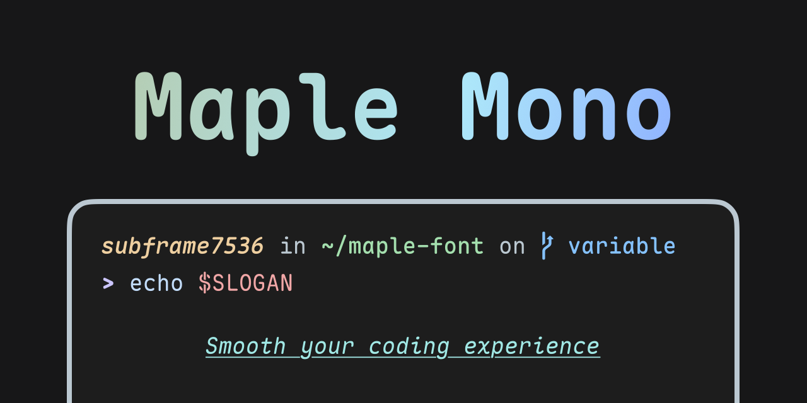
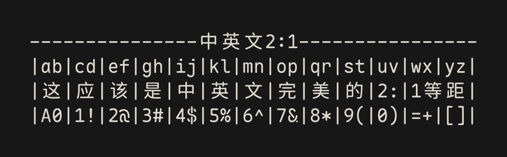

<p align="center">
  <a href="https://trendshift.io/repositories/13165" target="_blank"></a>
  <a href="https://hellogithub.com/repository/0601f355bd824d88b58f1af3066c486a" target="_blank"></a>
</p>
<p align="center">
  
  
  
</p>
<p align="center">
  
  
  
  
</p>

<p align="center">
  <a href="#다운로드-및-설치">다운로드</a> |
  <a href="https://font.subf.dev">웹사이트</a> |
  <a href="./README.md">English</a> |
  <a href="./README_CN.md">简中</a> |
  <a href="./README_TC.md">繁中</a> |
  <a href="./README_JP.md">日本語</a> |
  한국어
</p>

> [!WARNING]
> V8은 아직 개발 중이며 정식 출시되지 않았습니다. 안정 버전이 필요하다면 [`v7` 브랜치](https://github.com/subframe7536/maple-font/tree/v7)를 사용하세요.

# Maple Mono

Maple Mono는 코딩을 더 편안하고 효율적으로 할 수 있도록 만든 오픈 소스 고정폭 글꼴입니다.

제 작업 효율을 높이기 위해 만들었으며, 더 많은 사람이 즐겁게 코드를 작성하는 데 도움이 되기를 바랍니다.

## Maple Mono를 선택하는 이유

- ✨ **가변 글꼴 지원** - 글꼴 두께를 연속적으로 조절할 수 있으며, 기울임 글리프를 세밀하게 다듬었습니다.
- ☁️ **둥근 형태와 시각적 개선** - 전체적으로 둥근 디자인을 사용하고 `@ $ % & Q ->` 같은 핵심 기호를 다시 그렸으며, 기울임 연결(`f i j k l x y`)을 개선하고 여러 문자 폭 모드를 제공합니다.
- 🪄 **스마트 합자 강화** - 다양한 스마트 합자, 문자 변형, OpenType 스타일 세트와 상태 라벨 합자를 제공하여 코드를 더 읽기 쉽고 표현력 있게 만듭니다.
- 🔣 **확장된 Unicode 지원** - 상자 그리기 문자, 점자, 수학 연산자(U+2200–U+22FF), 체스와 카드 기호, 터미널 상태 및 진행률 기호, Claude Code 상태 로딩 기호를 지원합니다.
- 🎨 **Nerd Font 아이콘 지원** - [Nerd Fonts](https://github.com/ryanoasis/nerd-fonts)를 기본으로 통합하여 다양한 개발 도구와 터미널 환경에서 사용할 수 있습니다.
- 🔨 **높은 사용자 설정 가능성** - OpenType 기능, 상태 라벨 합자, 줄 높이, 문자 폭과 글꼴 두께 매핑을 설정하거나 소스에서 전용 글꼴을 생성할 수 있습니다.

### 중국어 간체, 중국어 번체, 일본어 및 한국어

Maple Mono는 CJK 문자 세트를 지원합니다. V7과 비교해 V8은 CJK 문자 세트를 크게 확장하고 개선하여 중국어 간체, 중국어 번체, 일본어 및 한국어를 지원합니다. 다국어 텍스트와 Markdown 표를 정렬하기 위해 CJK 문자와 라틴 문자는 2:1 폭으로 맞춰집니다. 그 대신 기본 CJK 문자 간격은 일반적인 한국어 글꼴보다 넓습니다. 자세한 내용은 [이 이슈](https://github.com/subframe7536/maple-font/issues/211)를 참고하세요.

| 지역 | 지원 범위                                       | CJK 글꼴 소스                                                                          | 빌드 출력 |
| ---- | ----------------------------------------------- | -------------------------------------------------------------------------------------- | --------- |
| CN   | 중국어 간체 및 일반적인 중국어 번체·일본어 문자 | [WenYuan Rounded SC](https://github.com/takushun-wu/WenYuanFonts)                      | `CN`      |
| TC   | 중국어 번체                                     | [Chiron Go Round TC](https://github.com/chiron-fonts/chiron-go-round-tc)               | `TC`      |
| JP   | 일본어                                          | [Resource Han Rounded JP](https://github.com/CyanoHao/Resource-Han-Rounded)            | `JP`      |
| KR   | 한국어                                          | [Chiron Go Round TC](https://github.com/chiron-fonts/chiron-go-round-tc)의 한국어 범위 | `KR`      |

CJK 빌드는 기본적으로 비활성화되어 있습니다. CJK 빌드 설정에서 대상 지역, 정적 또는 가변 출력과 선택적 압축 간격을 지정할 수 있습니다.

<!--
|Go|od| t|yp|og|ra|ph|y |re|ad|s |ea|si|ly|
|优|美|的|字|体|让|阅|读|变|得|更|加|轻|松|
|優|美|的|字|體|讓|閱|讀|變|得|更|加|輕|鬆|
|美|し|い|書|体|は|も|っ|と|読|み|や|す|い|
|아|름|다|운|글|꼴|은|더|읽|기|가|편|해|요|
|1!|2@|3#|4$|5%|6^|7&|8*|9(|0)|_+|{}|[]|;:|
-->



## 미리보기


- 생성 도구: [CodeImg](https://github.com/subframe7536/vscode-codeimg)
- 테마: [Maple](https://github.com/subframe7536/vscode-theme-maple)
- 설정: 글꼴 크기 16px, 줄 높이 1.8, 기본 글자 간격

## 시작하기

### 다운로드 및 설치

[Releases](https://github.com/subframe7536/maple-font/releases/latest)에서 글꼴 압축 파일을 다운로드할 수 있습니다.

Scoop, Homebrew, AUR/Paru, NixPkgs 등의 패키지 관리자를 통해 Maple Mono를 설치할 수도 있습니다. 자세한 내용은 [설치 가이드](./docs/install.md)를 참고하세요.

### 사용법 및 기능 설정

사용법과 설정은 [사용 가이드](./docs/usage.md)를 참고하세요.

#### 이름 규칙 및 글꼴 선택

Maple Mono는 사용자 피드백을 반영하여 여러 글꼴 형식과 문자 세트 범위를 제공합니다. 사용 목적에 맞는 글꼴 파일을 선택하려면 [글꼴 선택](./docs/choose.md)을 참고하세요.

### CDN

### Maple Mono

- [fontsource](https://fontsource.org/fonts/maple-mono)
- [ZeoSeven Fonts](https://fonts.zeoseven.com/items/443/)

## 주요 기능

[page#todo]()에서 모든 주요 기능을 미리 볼 수 있습니다.

### 사용자 정의 빌드

Maple Mono는 높은 수준의 사용자 정의 빌드를 제공합니다. [`config.json`](./config.json)을 수정하거나 명령줄 인수를 추가하여 필요한 글꼴을 생성할 수 있습니다. 자세한 내용은 [사용자 정의 빌드](./docs/build.md)를 참고하세요.

전체 [`build.py` 명령줄 옵션 목록](#buildpy-cli)을 확인하세요.

### 좁은 글리프

V8에서는 세 가지 문자 폭 모드를 제공합니다. [`config.json`](./config.json)의 `"width"` 필드를 수정하거나 명령줄에서 `--width <mode>`를 사용하세요.

사용 가능한 모드:

- default: 600
- narrow: 550
- slim: 500


### OpenType 기능 전환

OpenType 기능은 글꼴에 내장된 변형과 합자를 제어하며, 대부분의 최신 운영체제, 브라우저, 터미널과 편집기에서 지원됩니다. OpenType 기능을 활성화하거나 비활성화하여 합자와 문자 스타일을 조절할 수 있습니다.

Maple Mono는 세밀하게 조정할 수 있는 OpenType 기능을 많이 제공합니다. 설정 부담을 줄이기 위해 빌드 시 다음 세 가지 처리 방식을 선택할 수 있습니다（[이유](https://github.com/subframe7536/maple-font/issues/233#issuecomment-2410170270)）:

1. `enable`: 글꼴 기능 설정에서 `cvXX` / `ssXX` / `zero`를 설정하지 않아도 해당 기능을 강제로 활성화합니다.
2. `disable`: `cvXX` / `ssXX` / `zero`에서 해당 기능을 제거하여 수동으로 활성화해도 적용되지 않게 합니다.
3. `ignore`: 기본 동작을 그대로 유지합니다.

### Normal 프리셋

Maple Mono의 기본 글리프 디자인은 개성이 강해 모든 사람의 취향이나 사용 환경에 맞지는 않을 수 있습니다. `--normal` 빌드 프리셋은 `JetBrains Mono`와 비슷한 글리프를 생성합니다（`0`의 가운데가 점이 아니라 사선입니다）.

`--normal`은 다음 기능을 활성화합니다:

```
cv01, cv02, cv33, cv34, cv35, cv36, cv61, cv62, ss05, ss06, ss07, ss08
```


#### 사용자 정의 OpenType 기능

대부분의 글꼴은 사용자 정의 OpenType 기능을 지원하지 않지만 Maple Mono는 프로그래밍 방식으로 해당 기능을 정의할 수 있습니다.

기본적으로 [`scripts/feature/`](./scripts/feature)의 Python 모듈이 OpenType 기능 코드를 생성하고 빌드 시 불러옵니다. 기능이나 라벨을 수정하려면 해당 모듈을 변경하세요. `.fea` 소스 파일을 직접 편집하려면 `build.py`에 `--apply-fea-file`을 추가하면 됩니다. 빌드 스크립트가 [`source/features/{regular,italic}{_cn,}.fea`](./source/features)를 읽습니다.

### 무한 화살표 합자

Fira Code와 Cascadia Code에서 영감을 받아 Maple Mono는 v7.3부터 무한 화살표 합자를 지원합니다. 렌더링 문제로 인해 Hinted 글꼴에서는 화살표 합자가 어긋날 수 있으므로 v7.4부터 Hinted 버전에서는 이 기능을 기본적으로 제거했습니다.

`config.json`에 `"infinite_arrow": true`를 설정하거나 명령줄에 `--infinite-arrow`를 추가하여 강제로 활성화할 수 있습니다. 문제는 [#508](https://github.com/subframe7536/maple-font/issues/508)에서 논의해 주세요.


### 표준 Zero 기능

기본적으로 `0`은 사선 모양이며 `zero`를 활성화하면 점 모양이 됩니다. `--standard-zero`를 사용하면 표준 OpenType 의미로 복원되어 기본 `0`은 점 모양이고 `zero`를 활성화하면 사선 모양이 됩니다.

### 사용자 정의 줄 높이

Maple Mono의 기본 줄 높이는 `1`입니다. [`config.json`](./config.json)의 `"line_height"` 필드를 수정하거나 명령줄에서 `--line-height <value>`를 사용하세요. 최종 줄 높이는 `(ascender - descender) * line_height`로 계산됩니다.

### 사용자 정의 Unicode 매핑

Maple Mono에 일부 Unicode 코드 포인트가 없으면 해당 문자가 표시되지 않을 수 있습니다. [`config.json`](./config.json)의 `"codepoint_alias"` 항목을 수정하여 Unicode 매핑을 사용자 정의할 수 있습니다.

```json
{
  "codepoint_alias": {
    "U+E000": "U+E001",
    "U+E002": "U+E003"
  }
}
```

### 사용자 정의 글꼴 두께 매핑

`config.json`의 `"weight_mapping"` 항목으로 정적 글꼴의 굵기를 변경할 수 있습니다.

```json
{
  "weight_mapping": {
    "thin": 100,
    "extralight": 200,
    "light": 300,
    "regular": 350,
    "semibold": 500,
    "medium": 600,
    "bold": 700,
    "extrabold": 800
  }
}
```

### 사용자 정의 Nerd Font 설정

Maple Mono는 Nerd Font 아이콘을 내장하고 명명 규칙을 따릅니다. 기본적으로 각 아이콘은 라틴 문자 한 개의 전진 폭을 사용하지만 글리프의 실제 폭은 달라질 수 있습니다.

- 아이콘을 라틴 문자 하나의 폭（Nerd Font Mono）으로 만들려면 `config.json`에서 `"nerd_font.mono": true`를 설정하거나 빌드 인수에 `--nf-mono`를 추가하세요.
- 가변 폭 아이콘을 사용하려면 `config.json`에서 `"nerd_font.propo": true`를 설정하거나 빌드 인수에 `--nf-propo`를 추가하세요.

`font-patcher` 인수를 사용자 정의하려면 `fontforge`（필요할 경우 `python3-fontforge`도）를 설치해야 합니다. [config.json](./config.json)의 `"nerd_font.extra_args"`를 수정해야 할 수도 있습니다.


#### 인수 해석 규칙

기본 인수: `-l --careful --outputdir dir`

- `"nerd_font.propo"`가 `true`이면 `--variable-width-glyphs`를 추가합니다.
- `"nerd_font.mono"`가 `true`이면 `--mono`를 추가합니다.

## CJK 버전（한국어）

기본적으로 한국어 글꼴은 생성되지 않습니다. `python build.py`에 `--cjk kr`을 추가하면 빌드 스크립트가 [GitHub Release](https://github.com/subframe7536/maple-font/releases/tag/cjk-base)에서 한국어 기본 글리프를 다운로드합니다.

### CJK 글자 간격 줄이기

라틴 문자의 간격은 정상인데 CJK 문자만 **너무 넓은** 경우 빌드 옵션 `cjk.narrow` 또는 명령줄 인수 `--cjk-narrow`를 사용할 수 있습니다. 이렇게 하면 글꼴이 더 이상 엄격한 고정폭 글꼴로 인식되지 않습니다.

자세한 효과와 논의는 [#249](https://github.com/subframe7536/maple-font/issues/249#issuecomment-2871260476)를 참고하세요.

- 라틴 문자 폭도 바꾸려면 [`--width` 인수](#좁은-글리프)를 사용하세요.

### 가운데 정렬된 전각 문장 부호

Maple Mono는 전각 문장 부호를 가운데 정렬하는 `cpct` 기능을 지원하며, `cv99` 기능을 활성화하여 이 동작을 강제로 적용할 수도 있습니다. 자세한 내용은 [#150](https://github.com/subframe7536/maple-font/issues/150)을 참고하세요.

### GitHub 미러

빌드 스크립트는 필요한 리소스를 GitHub에서 자동으로 다운로드합니다. 다운로드에 실패하면 [config.json](./config.json)에 `github_mirror`를 설정하거나 `$GITHUB`를 환경 변수로 지정하세요. 대상 URL 형식은 `https://<github_mirror>/<user>/<repo>/releases/download/<tag>/<file>`입니다. 대상 `.zip` 파일을 직접 다운로드하여 `build.py`가 있는 디렉터리에 둘 수도 있습니다.

<a id="buildpy-cli"></a>

## `build.py` 명령줄 옵션

```text
사용법: build.py [-h] [-v] [-d] [--debug] [-n] [--standard-zero] [--feat FEAT]
                 [--apply-fea-file] [--hinted | --no-hinted]
                 [--liga | --no-liga] [--infinite-arrow] [--remove-tag-liga]
                 [--line-height LINE_HEIGHT] [--width {default,narrow,slim}]
                 [--format FORMATS] [--least-styles] [--cache] [--archive]
                 [--nf | --no-nf] [--nf-mono] [--nf-propo] [--nf-variable]
                 [--font-patcher] [--cjk CJK] [--cjk-variable] [--cjk-narrow]
                 [--cjk-scale-factor CJK_SCALE_FACTOR] [--cjk-both]
                 [--cjk-hinted | --no-cjk-hinted] [--cn | --no-cn]
                 [--cn-narrow] [--cn-scale-factor CN_SCALE_FACTOR] [--cn-both]

Maple Mono 빌더 및 최적화 도구

옵션:
  -h, --help            이 도움말을 표시하고 종료합니다
  -v, --version         프로그램 버전을 표시하고 종료합니다
  -d, --dry             설정을 출력하고 종료합니다
  --debug               빠른 디버그 빌드를 사용합니다. `Debug`를 추가하고,
                        디버그 로깅을 활성화하며 Regular/Italic만 빌드하고,
                        OTF/WOFF2/Nerd Font 출력을 건너뜁니다

기능 옵션:
  -n, --normal          `JetBrains Mono`와 비슷한 Normal 프리셋을 사용하며,
                        `0`은 사선 모양이 됩니다
  --standard-zero       표준 zero 의미를 사용합니다. 기본 `0`은 점 모양이고,
                        `zero`를 활성화하면 사선 모양이 됩니다
  --feat FEAT           지정한 기능을 활성화하고 고정합니다. `,`로 구분합니다
                        (예: `--feat zero,cv01,ss07,ss08`). 문맥 규칙은 `calt`를
                        통해 활성화됩니다
  --apply-fea-file      일치하는
                        `source/features/{regular,italic}{_cn,}.fea`를 정적 및 가변 글꼴에 적용합니다
  --hinted              NF/CJK/NF-CJK의 기본 글꼴로 힌팅된 글꼴을 사용합니다（기본값）
  --no-hinted           NF/CJK/NF-CJK의 기본 글꼴로 힌팅되지 않은 글꼴을 사용합니다
  --liga                모든 합자를 유지합니다（기본값）
  --no-liga             모든 합자를 제거합니다
  --infinite-arrow      무한 화살표 합자를 활성화합니다（Hinted 글꼴에서는 기본적으로 비활성화）
  --remove-tag-liga     `[TODO]`와 같은 일반 텍스트 태그 합자를 제거합니다
  --line-height LINE_HEIGHT
                        줄 높이 배율（예: 1.1）
  --width {default,narrow,slim}
                        글리프 폭을 설정합니다: default（600）, narrow（550）, slim（500）

빌드 옵션:
  --format FORMATS      필요한 기본 출력 형식을 쉼표로 구분해 선택합니다: ttf, otf, woff2.
                        가변 글꼴 기본 버전은 항상 빌드됩니다
  --least-styles        Regular / Bold / Italic / BoldItalic 스타일만 빌드합니다
  --cache               `fonts/` 아래의 유효한 캐시 파이프라인 단계를 재사용하고,
                        관련 없는 기존 출력을 보존합니다
  --archive             설정과 라이선스를 포함하여 기존의 각 비 JSON 출력 디렉터리를 보관합니다

Nerd Font 옵션:
  --nf, --nerd-font     Nerd Font 버전을 빌드합니다（기본값）
  --no-nf, --no-nerd-font
                        Nerd Font 버전을 빌드하지 않습니다
  --nf-mono             Nerd Font 아이콘 폭을 고정합니다
  --nf-propo            Nerd Font 아이콘 폭을 가변으로 만들고 `--nf-mono`를 덮어씁니다
  --nf-variable         Nerd Font를 가변 글꼴로 빌드합니다
  --font-patcher        Nerd Font Patcher를 사용해 NF 형식을 빌드하도록 강제합니다

CJK 옵션:
  --cjk CJK             cn, jp, tc, kr 로케일용 Maple Mono + CJK 확장 글꼴을 빌드합니다.
                        반복해서 지정하거나 쉼표로 구분할 수 있습니다
  --cjk-variable        CJK 확장 출력을 병합된 가변 글꼴로 유지합니다
  --cjk-narrow          선택한 로케일에 좁은 CJK 간격을 적용합니다
  --cjk-scale-factor CJK_SCALE_FACTOR
                        선택한 CJK 로케일의 배율을 설정합니다. 형식:
                        <factor> 또는 <width_factor>,<height_factor>
  --cjk-both            Nerd Font가 활성화되면 NF CJK와 비 NF CJK 출력을 모두 빌드합니다
  --cjk-hinted          최종 정적 CJK 글꼴에 자동 힌팅을 적용합니다
  --no-cjk-hinted       최종 정적 CJK 글꼴에 자동 힌팅을 적용하지 않습니다（기본값）

더 이상 사용하지 않는 CN 옵션:
  --cn                  더 이상 사용하지 않습니다. `--cjk cn`의 별칭입니다
  --no-cn               더 이상 사용하지 않습니다. 선택한 CJK 로케일에서 `cn`을 제거하는 별칭입니다
  --cn-narrow           더 이상 사용하지 않습니다. `cn` 대상 `--cjk-narrow`의 별칭입니다
  --cn-scale-factor CN_SCALE_FACTOR
                        더 이상 사용하지 않습니다. `cn` 대상 `--cjk-scale-factor`의 별칭입니다
  --cn-both             더 이상 사용하지 않습니다. `--cjk-both`의 별칭입니다
```

## 감사의 글

- [JetBrains Mono](https://github.com/JetBrains/JetBrainsMono)
- [Fira Code](https://github.com/tonsky/FiraCode)
- [Cascadia Code](https://github.com/microsoft/cascadia-code)
- [Roboto Mono](https://github.com/googlefonts/RobotoMono)
- [Victor Mono](https://github.com/rubjo/victor-mono)
- [Commit Mono](https://github.com/eigilnikolajsen/commit-mono)
- [Code Sample](https://github.com/TheRenegadeCoder/sample-programs-website)
- [Nerd Font](https://github.com/ryanoasis/nerd-fonts)
- [Font Freeze](https://github.com/MuTsunTsai/fontfreeze/)
- [Font Viewer](https://tophix.com/font-tools/font-viewer)
- [Monolisa](https://www.monolisa.dev/)
- [Recursive](https://www.recursive.design/)

## 후원

이 글꼴이 도움이 되었다면 [아이파뎬](https://afdian.com/a/subframe7536)을 통해 후원해 주세요.

## Star History

<a href="https://star-history.dera.page/#subframe7536/maple-font&type=date&legend=top-left">
 <picture>
   <source media="(prefers-color-scheme: dark)" srcset="https://star-history.dera.page/svg?repos=subframe7536/maple-font&type=date&theme=dark&legend=top-left" />
   <source media="(prefers-color-scheme: light)" srcset="https://star-history.dera.page/svg?repos=subframe7536/maple-font&type=date&legend=top-left" />
   
 </picture>
</a>

## 라이선스

SIL Open Font License 1.1
