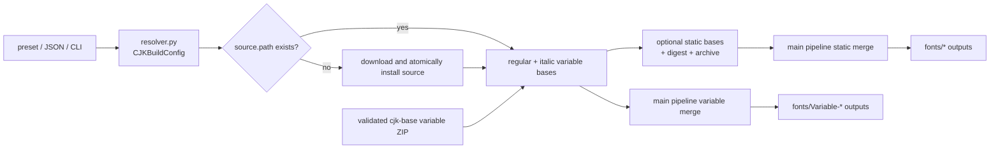

# Maple Mono CJK Subsystem

The CJK subsystem converts a source CJK variable font into reusable Maple bases and merges those bases into release fonts. It has two separate workflows and two separate caches:

| Workflow             | Command                          | Output and cache                                                                                                                                                                            |
| -------------------- | -------------------------------- | ------------------------------------------------------------------------------------------------------------------------------------------------------------------------------------------- |
| Build reusable bases | `uv run task.py cjk --preset cn` | Writes `source/cjk/<locale>/` variable bases, a variable digest/archive, optional static instances, a static digest, and a static archive. The standalone task always rebuilds the regular and italic variable bases. |
| Build release fonts  | `uv run build.py --cjk cn`       | Merges selected profiles under `fonts/<LOCALE>/`, `fonts/NF-<LOCALE>/`, `fonts/Variable-<LOCALE>/`, or `fonts/Variable-NF-<LOCALE>/`; `--nf-mono` and `--nf-propo` use matching standalone directories and are local-only. |

The standalone CJK artifacts under `source/cjk/` are independent from the main pipeline cache under `fonts/`. This document covers CJK decisions and fallback; the global stage lifecycle is in [`../pipeline/README.md`](../pipeline/README.md), and the update/publish procedure is in [`../maintenance.md`](../maintenance.md).

## Static and variable output modes

The main pipeline's `cjk.variable` / `--cjk-variable` selects the release shape:

| Mode               | Per profile                                                                                        | Directory                                                             | Use it when                                                                                   |
| ------------------ | -------------------------------------------------------------------------------------------------- | --------------------------------------------------------------------- | --------------------------------------------------------------------------------------------- |
| `static` (default) | Up to 16 TTFs: 8 weights, each regular and italic; `--debug`/`--least-styles` can reduce this set. | Plain: `fonts/<LOCALE>/`; NF: `fonts/NF-<LOCALE>/`, `fonts/NFMono-<LOCALE>/`, or `fonts/NFPropo-<LOCALE>/`. | Consumers need installable instance fonts, AutoHint, or the smallest runtime feature surface. |
| `variable`         | Two TTFs: regular and italic `[wght]` files.                                                       | Plain: `fonts/Variable-<LOCALE>/`; NF: `fonts/Variable-NF-<LOCALE>/`, `fonts/Variable-NFMono-<LOCALE>/`, or `fonts/Variable-NFPropo-<LOCALE>/`. | Consumers need continuous weight variation and can use variable OpenType behavior. |

The standalone task writes two preprocessed variable base files, regular and italic, plus `<locale>-base-variable.zip` and `variable-<locale>.sha256`. The variable archive contains exactly those two root-level TTFs, and both fonts must retain `fvar`. It also writes up to 16 static base instances unless `--vf-only` is set. The main pipeline reuses local variable files first, then validates the local variable archive or downloads and validates the matching `cjk-base` archive, before rebuilding from the original source.

## Plain and Nerd Font profiles

`nerd_font.enable` controls whether the main pipeline builds the NF base. `cjk.with_nerd_font` controls whether each selected CJK entry is eligible for an NF profile. When both are true, the normal selection is NF-CJK. `--cjk-both` adds the plain profile alongside NF-CJK; if NF is disabled, only the plain profile can be produced. The same rule is applied independently to every locale and every output mode.

The default NF profile uses `NF-*` and `Variable-NF-*` directories. `--nf-mono` and `--nf-propo` use `NFMono-*` / `Variable-NFMono-*` and `NFPropo-*` / `Variable-NFPropo-*` instead. Release jobs publish only the default NF locale packages; Mono and Propo CJK or variable builds remain supported for custom local builds but are not release targets.

## Hinting and cache controls

The global `use_hinted` setting, exposed by `--hinted` and `--no-hinted`, chooses the Latin static base and the NF static base used before a static CJK merge. It does not itself AutoHint the merged CJK files. The CJK-specific `cjk.use_hinted` setting controls a second step: after the final plain or NF CJK static fonts are instantiated or merged, it runs AutoHint on those files. These settings are independent; variable CJK outputs are not selected by either static AutoHint step.

`task.py cjk` always rebuilds regular and italic variable bases, even when both files already exist. In the main pipeline, `ensure_cjk_variable_fonts` reuses both existing variable files when `clean_cache` is false and falls back to a fresh `vf_only` source build otherwise. `clean_cache` never deletes files and does not bypass a valid static directory digest: a static directory with all required styles and a matching `static-<locale>.sha256` is reused first.

## Source and fallback order

For a main-pipeline static merge, the actual resolution order is:

1. **Valid local static directory.** Reuse the required styles when the static directory and its `static-<locale>.sha256` digest are valid. This path wins even when `clean_cache` is enabled.
2. **Valid local static archive.** If the directory cache is unavailable, validate and extract the generated `<locale>-base-static.zip` before considering any network source.
3. **Remote static archive.** If the local static archive is unavailable or invalid and the locale has a supported release archive, download and validate it. An incomplete or invalid archive is preserved and resolution continues.
4. **Local variable bases.** If both regular and italic variable files exist and `clean_cache` is false, instantiate the requested static styles locally and validate the resulting directory digest.
5. **Valid local variable archive.** If the variable files are unavailable, validate and install the generated `<locale>-base-variable.zip` before considering any network source.
6. **Remote variable archive.** If the local variable archive is unavailable or invalid and the locale has a matching `cjk-base` variable archive, download it, validate its two exact members, `fvar` tables, ZIP integrity, and committed variable hash, then instantiate the requested static styles.
7. **Source rebuild.** If the remote variable archive is unavailable or invalid, resolve the configured source/download and rebuild the regular and italic variable bases with `vf_only=True`, then instantiate and validate the static styles.

An existing but invalid static directory is never silently removed, and a failed fallback raises `CJKBaseUnavailable` after the available sources have been tried. Variable-mode release output uses the same local-file, local-archive, validated remote-archive, or source-rebuild rule, without requiring a static directory.

## System shape



## Ownership map

| Module                    | Responsibility                                                                                                                        |
| ------------------------- | ------------------------------------------------------------------------------------------------------------------------------------- |
| `config.py`               | Typed CJK configuration, Unicode presets, transforms, output defaults, and naming defaults.                                           |
| `resolver.py`             | JSON/CLI parsing, validation, Unicode and axis overrides, and locale-derived paths and names.                                         |
| `presets.py`              | Built-in CN, JP, TC, and KR metadata and config loading.                                                                              |
| `builder.py`              | Source resolution, subsetting, master preparation, variable-font generation, static instantiation, and standalone executor lifecycle. |
| `outlines.py`             | Glyph command replay, compatibility checks, and CFF/CFF2-to-glyf conversion.                                                          |
| `variable.py`             | Variable-font loading, master merging, `gvar` construction, italic transforms, and table cleanup.                                     |
| `cache.py`                | Static-directory and variable-file digest creation, archive validation, and cache checks for standalone CJK assets.                 |
| `static.py`               | Main-build CJK static naming, metrics, metadata, feature application, and width processing.                                           |
| `pipeline/cjk_outputs.py` | Merge CJK bases with Maple and Nerd Font outputs and publish final stages.                                                            |
| `config/runtime.py`       | Resolve local static bases and archives, remote static/variable archives, local VFs, and source regeneration for the main build. |
| `task/cjk.py`             | Register `task.py cjk` and dispatch preset, JSON, or direct-CLI builds.                                                               |

## Generated layout

For `locale_name: "CN"`, the resolver derives these names; other locales follow the same rule:

| Path                                           | Meaning                                               |
| ---------------------------------------------- | ----------------------------------------------------- |
| `source/cjk/cn/config-cn.json`                 | Built-in source configuration.                        |
| `source/cjk/cn/MapleMono-CN-VF.ttf`            | Regular generated variable base.                      |
| `source/cjk/cn/MapleMono-CN-Italic-VF.ttf`     | Italic generated variable base.                       |
| `source/cjk/cn/variable-cn.sha256`             | Digest of only the regular and italic variable bases. |
| `source/cjk/cn/cn-base-variable.zip`           | Regenerated regular/italic variable-base archive.     |
| `source/cjk/cn/static/MapleMonoCN-<Style>.ttf` | Named static CJK base instance.                       |
| `source/cjk/cn/static-cn.sha256`               | Digest of the static directory contents.              |
| `source/cjk/cn/cn-base-static.zip`             | Regenerated static-base archive.                      |
| `source/cjk/variable-source/`                  | Cached source and Maple feature/metadata font inputs. |

These are generated artifacts. Edit the JSON config or generator, then rebuild; never patch a generated font or archive by hand.

## Configuration and source phases

The public JSON surface is intentionally small: `locale_name`, `freeze_feature`, `source`, `unicode`, and `transform`. `freeze_feature` optionally enables one OpenType feature in generated static CJK fonts; output layout, naming, feature font, temporary paths, and outline mode are derived or fixed by the builder.

```json
{
  "$schema": "./cjk_schema.json",
  "locale_name": "HK",
  "freeze_feature": "cv99",
  "source": {
    "path": "MyCJK-VF.ttf",
    "masters": {
      "100": { "wght": 200 },
      "400": { "wght": 400 },
      "800": { "wght": 900 }
    }
  }
}
```

`source.path` must point to a variable font with `fvar` and exactly one outline format, `glyf` or `CFF2`. Optional configuration controls downloads, dropped tables, Unicode ranges and encoding filters, feature-codepoint exclusions, and width/scale/translation/italic transforms. CLI values override loaded config; inspect all options with `uv run task.py cjk --help`.

The build phases are source resolution, Unicode subsetting, 100/400/800 master preparation, outline normalization, variable-base generation, optional static instantiation, and finally main-pipeline merging. CFF2 sources are converted to compatible `glyf` masters before static or variable merge work.

## Built-in presets and validation

| Preset | Config                         | Source outline | Output directory |
| ------ | ------------------------------ | -------------- | ---------------- |
| CN     | `source/cjk/cn/config-cn.json` | `glyf`         | `source/cjk/cn`  |
| JP     | `source/cjk/jp/config-jp.json` | `CFF2`         | `source/cjk/jp`  |
| TC     | `source/cjk/tc/config-tc.json` | `glyf`         | `source/cjk/tc`  |
| KR     | `source/cjk/kr/config-kr.json` | `glyf`         | `source/cjk/kr`  |

For focused checks and the CJK base update procedure, see [`../maintenance.md`](../maintenance.md). Avoid a full CJK build unless source download, outline conversion, or generated artifacts are part of the requested change.
