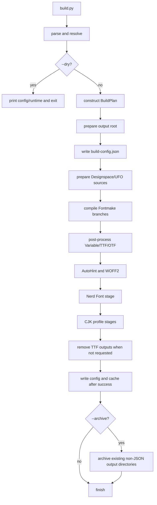

# Maple Build Pipeline

[`orchestrator.py`](orchestrator.py) coordinates stage selection, cache transitions, cleanup, and archiving. [`fontmake.py`](fontmake.py) owns source preparation, Fontmake compilation, and base Variable/TTF/OTF post-processing. [`base_fonts.py`](base_fonts.py) produces AutoHint TTFs and WOFF2 files from the already-published static TTF outputs.

Read this document with [`scripts/README.md`](../README.md), which defines package ownership and output layout. Follow [`scripts/maintenance.md`](../maintenance.md) for source, generated-file, CJK, and release procedures.

## Entry points and state

`main(args, version)` parses CLI arguments, resolves `ResolvedConfig`, creates a `BuildRuntimeContext`, and handles `--dry` before constructing a `BuildPlan`. For a normal build it constructs `MapleBuildPipeline` and calls `build()`.

| State                 | Owner               | Purpose                                                                                                                         |
| --------------------- | ------------------- | ------------------------------------------------------------------------------------------------------------------------------- |
| `ResolvedConfig`      | `config/`           | Normalized user intent: formats, styles, feature options, Nerd Font options, CJK selections, cache policy, and output settings. |
| `BuildRuntimeContext` | `config/runtime.py` | Filesystem paths, resolved vertical metrics, and mutable upstream-output flags.                                                 |
| `CJKBaseResolver`     | `cjk/resolver.py`      | Resolves and validates local/remote static or variable CJK bases before source rebuild fallback.                           |
| `BuildPlan`           | `orchestrator.py`   | Derived stage policy: target styles, base formats, WOFF2, Nerd Font, CJK mode, cleanup, and archive selection.                  |
| Cache record          | `pipeline/cache.py` | Per-stage identities, exact output snapshots, and file digests persisted in `fonts/build-cache.json`.                           |

`BuildPlan` is derived once for a normal build. Dry-run resolves and prints the config/runtime view, then returns without creating one. Local dry-run stdout has two labeled JSON objects, while CI stdout is only the resolved config JSON; warnings are logged to stderr.

## Normal call order

The normal pipeline creates one shared executor for preparation, compilation, post-processing, and derived stages. Temporary Fontmake work under `fonts/temp/` is removed after base work, including the failure path.

## BuildPlan decisions

| Decision      | Rule                                                                                                                                                   |
| ------------- | ------------------------------------------------------------------------------------------------------------------------------------------------------ |
| Target styles | `least_styles` selects Regular, Bold, Italic, and BoldItalic; `debug` selects Regular and Italic; otherwise all styles are eligible.                   |
| Base formats  | Variable is always required. TTF is required for requested TTF/WOFF2 or hinted consumers. OTF is added only when requested and the build is not debug. |
| WOFF2         | Built only when requested and not in debug mode, from static TTF output in `fonts/TTF/` into `fonts/Woff2/`.                                           |
| Nerd Font     | Built when `nerd_font.enable` is true; debug resolution disables it.                                                                                   |
| CJK mode      | `None` when no locale is selected; otherwise the configured `static` or `variable` mode.                                                               |
| CJK profiles  | NF is selected when the NF stage is available and `with_nerd_font` is true; plain is added when NF is unavailable or `cjk-both` is enabled.            |
| Cleanup       | If TTF is not requested, remove `fonts/TTF/` and `fonts/TTF-AutoHint/` only after every consumer completes.                                            |
| Archive       | Controlled only by the resolved archive flag; it processes every existing non-JSON output directory at archive time and is never a cache stage.        |

## Stage contracts

### Base stages in `fontmake.py`

`prepare_fontmake_sources` loads the committed regular and italic Designspace/UFO sources, applies build metrics and feature configuration, freezes single substitutions across every master, and materializes the result in a disposable workspace.

`compile_fontmake_formats` submits Variable, TTF, and OTF Fontmake branches from those shared prepared sources. The module then post-processes metadata, names, aliases, and width verification before files are published under `fonts/Variable/`, `fonts/TTF/`, and `fonts/OTF/`. Worker functions stay at module scope so process executors can pickle them.

### Derived stages in `base_fonts.py`

AutoHint consumes published static TTFs and writes `fonts/TTF-AutoHint/`. WOFF2 conversion consumes `fonts/TTF/` and writes `fonts/Woff2/`. Each has an independent stage identity and can be reused without recompiling unrelated base formats.

### CJK stages

`_cjk_stage_targets` records separate locale/profile stages such as `cn-static`, `nf-cn-static`, `cn-variable`, and `nf-cn-variable`. Static output goes to `fonts/<LOCALE>/` or a variant directory such as `fonts/NF-<LOCALE>/`, `fonts/NFMono-<LOCALE>/`, or `fonts/NFPropo-<LOCALE>/`; variable output uses the matching `Variable-*` directory. A CJK cache miss removes only the selected stage record before rebuilding, so other locale and profile records and files remain available. Release jobs publish the default NF profile only; Mono and Propo CJK/VF outputs are supported for custom builds but are not release targets.

## Cache lifecycle and failure state

Caching is opt-in. With `--cache`, `prepare_output_root` reads `fonts/build-cache.json` and leaves existing output files and unrelated directories in place. It validates each stage using the recorded identity, exact relative output list, file existence, and content digest. A miss does not clear the stage directory; CJK misses only remove their own cache record.

Each requested stage is validated only after its task log section starts, then reports its `Cache hit` or `Cache miss` result. If the cache record is unavailable, every requested stage reports `missing-cache-record` in the active section instead of relying on one global miss.

Without `--cache`, the generated output root and WOFF2 directory are cleared before the build. If TTF was not requested, TTF and AutoHint directories are removed at the post-build cleanup point, after WOFF2/NF/CJK consumers have used them.

`build-config.json` is written before the executor starts and is rewritten by successful finalization. `build-cache.json` is written only by successful `write_build_record()`. If compilation or a later stage fails, the new config can remain while the cache is old, partially invalidated, or absent; no failed build is presented as a completed cache.

Stage identities contain the related resolved configuration, target styles, Designspace dimension dictionaries, generated feature-file fingerprint, and upstream stage identities. They intentionally exclude generator source code, dependency versions, UFO outline contents, and CJK base contents. Changing any of those excluded inputs requires a build without `--cache`.

## Executor and exception boundaries

Worker functions and job dataclasses stay at module scope so process spawning can pickle them. Pool size one uses `SynchronousExecutor`; larger pools use the process executor with thread fallback. Temporary workspaces are cleaned in `finally` blocks, while domain exceptions propagate so callers and tests can identify the failing stage. Only `BuildDependencyError` is converted by `main()` to a logged exit status.
